# Tutorial: Crear un bot&#243;n mediante Microsoft Expression Blend
Este tutorial le guía a lo largo del proceso de creación de un botón personalizado de [!INCLUDE[TLA2#tla_wpf](../../../../includes/tla2sharptla-wpf-md.md)] mediante Microsoft Expression Blend.  
  
> [!IMPORTANT]
>  Microsoft Expression Blend funciona generando [!INCLUDE[TLA#tla_xaml](../../../../includes/tlasharptla-xaml-md.md)] que luego se compila para crear el programa ejecutable.  Si prefiere trabajar directamente con [!INCLUDE[TLA#tla_xaml](../../../../includes/tlasharptla-xaml-md.md)], hay otro tutorial que crea la misma aplicación que este utilizando [!INCLUDE[TLA#tla_xaml](../../../../includes/tlasharptla-xaml-md.md)] con [!INCLUDE[vs_current_short](../../../../includes/vs-current-short-md.md)] en lugar de Blend.  Para obtener más información, consulte [Crear un botón mediante el uso de XAML](../../../../docs/framework/wpf/controls/walkthrough-create-a-button-by-using-xaml.md).  
  
 En la ilustración siguiente se muestra el botón personalizado que creará.  
  
   
  
## Convertir una forma en un Botón  
 En la primera parte de este tutorial, creará el aspecto personalizado del botón personalizado.  Para ello, lo primero que hará será convertir un rectángulo en un botón.  A continuación, agregará formas adicionales a la plantilla del botón para crear un botón con un aspecto más complejo.  ¿Por qué no es mejor comenzar con un botón normal y personalizarlo?  Porque un botón incluye funcionalidad integrada que no necesita; en el caso de los botones personalizados, es más fácil comenzar por un rectángulo.  
  
#### Para crear un nuevo proyecto en Expression Blend  
  
1.  Inicie Expression Blend.  \(Haga clic en **Inicio**, seleccione **Todos los programas**, **Microsoft Expression** y, a continuación, haga clic en **Microsoft Expression Blend**.\)  
  
2.  Maximice la aplicación si es necesario.  
  
3.  En el menú **Archivo**, haga clic en **Nuevo proyecto**.  
  
4.  Seleccione **Aplicación estándar \(.exe\)**.  
  
5.  Asigne al proyecto el nombre `BotónPersonalizado` y presione **Aceptar**.  
  
 En este momento dispone de un proyecto de [!INCLUDE[TLA2#tla_wpf](../../../../includes/tla2sharptla-wpf-md.md)] en blanco.  Puede presionar F5 para ejecutar la aplicación.  Como cabría esperar, la aplicación sólo contiene una ventana en blanco.  El siguiente paso consiste en crear un rectángulo redondeado y convertirlo en un botón.  
  
#### Para convertir un rectángulo en un botón  
  
1.  **Establezca la propiedad Fondo de la ventana en el color negro:** seleccione la ventana, haga clic en la ficha **Propiedades** y establezca la propiedad <xref:System.Windows.Controls.Control.Background%2A> en `Black`.  
  
       
  
2.  **Dibuje un rectángulo con el tamaño aproximado de un botón en la ventana:** seleccione la herramienta Rectángulo en el panel de herramientas de la izquierda y arrastre el rectángulo a la ventana.  
  
       
  
3.  **Redondee las esquinas del rectángulo:** arrastre los puntos de control del rectángulo o establezca directamente las propiedades <xref:System.Windows.Shapes.Rectangle.RadiusX%2A> y <xref:System.Windows.Shapes.Rectangle.RadiusY%2A>.  Establezca los valores de <xref:System.Windows.Shapes.Rectangle.RadiusX%2A> y <xref:System.Windows.Shapes.Rectangle.RadiusY%2A> en 20.  
  
       
  
4.  **Convierta el rectángulo en un botón:** seleccione el rectángulo.  En el menú **Herramientas**, haga clic en **Crear botón**.  
  
       
  
5.  **Especifique el ámbito del estilo o la plantilla:** aparece un cuadro de diálogo como el siguiente.  
  
       
  
     Para **Nombre de recurso \(clave\)**, seleccione **Aplicar a todo**.  Esto hará que el estilo y la plantilla del botón resultantes se apliquen a todos los objetos que sean botones.  Para **Definir en**, seleccione **Aplicación**.  Esto hará que el ámbito del estilo y de la plantilla del botón resultantes sea toda la aplicación.  Al establecer los valores de estos dos cuadros, el estilo y la plantilla del botón se aplicarán a todos los botones de la aplicación, y cualquier botón que cree en la aplicación usará esta plantilla de forma predeterminada.  
  
## Editar la plantilla del botón  
 Ahora, tiene un rectángulo convertido en un botón.  En esta sección, modificará la plantilla del botón y personalizará aún más su apariencia.  
  
#### Para editar la plantilla del botón con objeto de cambiar la apariencia del botón  
  
1.  **Pase a la vista de edición de plantillas:** para personalizar aún más a apariencia del botón, es necesario editar la plantilla del botón.  Esta plantilla se creó al convertir el rectángulo en un botón.  Para editar la plantilla del botón, haga clic con el botón secundario en el botón, seleccione **Editar partes del control \(plantilla\)** y, a continuación, seleccione **Editar plantilla**.  
  
       
  
     En el editor de plantillas, observe que el botón ahora está separado en una forma <xref:System.Windows.Shapes.Rectangle> y en un control <xref:System.Windows.Controls.ContentPresenter>.  <xref:System.Windows.Controls.ContentPresenter> se utiliza para presentar el contenido del botón \(por ejemplo, la cadena "Botón"\).  Tanto el rectángulo como el control <xref:System.Windows.Controls.ContentPresenter> se sitúan dentro de un control <xref:System.Windows.Controls.Grid>.  
  
       
  
2.  **Cambie los nombres de los componentes de la plantilla:** haga clic con el botón secundario en el rectángulo en el inventario de plantillas, cambie el nombre de la forma <xref:System.Windows.Shapes.Rectangle> de "\[Rectangle\]" a "RectánguloExterior" y cambie "\[ContentPresenter\]" por "MiContentPresenter".  
  
       
  
3.  **Modifique el rectángulo para que esté vacío \(como un anillo\):** seleccione **RectánguloExterior** y establezca <xref:System.Windows.Shapes.Shape.Fill%2A> en "Transparent" y <xref:System.Windows.Shapes.Shape.StrokeThickness%2A> en 5.  
  
       
  
     A continuación, establezca <xref:System.Windows.Shapes.Shape.Stroke%2A> en el color que tenga que tener la plantilla.  Para ello, haga clic en el cuadro blanco de pequeño tamaño situado junto a **Stroke**, seleccione **Expresión personalizada** y escriba "{Fondo de TemplateBinding}" en el cuadro de diálogo.  
  
     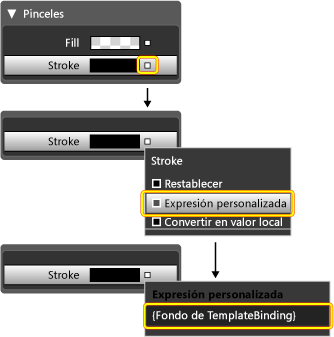  
  
4.  **Cree un rectángulo interior:** ahora, cree otro rectángulo \(denomínelo "RectánguloInterior"\) y colóquelo simétricamente dentro del **RectánguloExterior**.  Para este tipo de trabajo, es posible que le convenga hacer zoom a fin de ampliar el tamaño del botón en el área de edición.  
  
    > [!NOTE]
    >  Es posible que su rectángulo presente un aspecto distinto al de la ilustración \(por ejemplo, podría tener las esquinas redondeadas\).  
  
       
  
5.  **Mueva ContentPresenter a la parte superior:** llegado a este punto, es posible que el texto "Botón" ya no esté visible.  Si es así, se debe a que **RectánguloInterior** está encima de **MiContentPresenter**.  Para evitarlo, arrastre **MiContentPresenter** debajo de **RectánguloInterior**.  Cambie de posición los rectángulos y **MiContentPresenter** para que presenten un aspecto similar al de la ilustración.  
  
    > [!NOTE]
    >  También puede colocar **MiContentPresenter** en la parte superior haciendo clic con el botón secundario en él y presionando **Traer adelante**.  
  
       
  
6.  **Cambie el aspecto de RectánguloInterior:** establezca los valores de las propiedades <xref:System.Windows.Shapes.Rectangle.RadiusX%2A>, <xref:System.Windows.Shapes.Shape.StrokeThickness%2A> y <xref:System.Windows.Shapes.Rectangle.RadiusY%2A> en 20.  Además, establezca <xref:System.Windows.Shapes.Shape.Fill%2A> en el fondo de la plantilla utilizando la expresión personalizada "{Fondo de TemplateBinding}" y establezca <xref:System.Windows.Shapes.Shape.Stroke%2A> en "transparent".  Observe que la configuración para <xref:System.Windows.Shapes.Shape.Fill%2A> y <xref:System.Windows.Shapes.Shape.Stroke%2A> de **RectánguloInterior** es la opuesta a la de **RectánguloExterior**.  
  
       
  
7.  **Agregue una capa de cristal a la parte superior:** la última etapa del proceso de personalización del aspecto del botón consiste en agregar una capa de cristal a la parte superior.  Esta capa de cristal consta de un tercer rectángulo.  Dado que el cristal cubrirá todo el botón, el rectángulo de cristal es similar en dimensiones al **RectánguloExterior**.  Por ello, para crear el rectángulo basta con realizar una copia del **RectánguloExterior**.  Resalte el **RectánguloExterior** y use CTRL\+C y CTRL\+V para realizar una copia.  Asigne a este nuevo rectángulo el nombre "CuboCristal".  
  
8.  **Cambie de posición el CuboCristal si es necesario:** si el **CuboCristal** no está situado de forma que cubra todo el botón, arrástrelo a la posición correcta.  
  
9. **Déle al CuboCristal una forma ligeramente distinta de la que tiene RectánguloExterior:** cambie las propiedades de **CuboCristal**.  En primer lugar, cambie el valor de las propiedades <xref:System.Windows.Shapes.Rectangle.RadiusX%2A> y <xref:System.Windows.Shapes.Rectangle.RadiusY%2A> a 10 y el valor de la propiedad <xref:System.Windows.Shapes.Shape.StrokeThickness%2A> a 2.  
  
       
  
10. **Haga que CuboCristal se parezca al cristal:** configure <xref:System.Windows.Shapes.Shape.Fill%2A> de forma que presente un aspecto vítreo; para ello, utilice un degradado lineal con una opacidad del 75% y que alterne los colores blanco y transparente en 6 intervalos espaciados de forma más o menos uniforme.  Configure los puntos de degradado tal y como se indica a continuación:  
  
    -   Punto de degradado 1: blanco con valor alfa del 75%  
  
    -   Punto de degradado 2: transparente  
  
    -   Punto de degradado 3: blanco con valor alfa del 75%  
  
    -   Punto de degradado 4: transparente  
  
    -   Punto de degradado 5: blanco con valor alfa del 75%  
  
    -   Punto de degradado 6: transparente  
  
     De esta forma, creará un aspecto de cristal "ondulado".  
  
       
  
11. **Oculte la capa de cristal:** ahora que puede ver el aspecto de la capa de cristal, vaya al panel **Apariencia** del panel **Propiedades** y establezca la opacidad en 0% para ocultarla.  En las secciones siguientes, utilizaremos desencadenadores de propiedad y eventos para mostrar y manipular la capa de cristal.  
  
     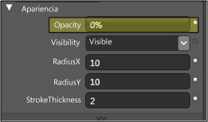  
  
## Personalizar el comportamiento del botón  
 Una vez llegado a este punto, ha personalizado la presentación del botón editando su plantilla, pero el botón no reacciona a las acciones del usuario del mismo modo que los botones normales \(por ejemplo, cambiando su aspecto al pasar el puntero por encima, recibiendo el foco o haciendo clic\). Los dos procedimientos siguientes muestran cómo hacer que el botón personalizado adopte comportamientos de este tipo.  Comenzaremos con desencadenadores de propiedad simples y, a continuación, agregaremos desencadenadores de eventos y animaciones.  
  
#### Para establecer desencadenadores de propiedad  
  
1.  **Cree un nuevo desencadenador de propiedad:** con **CuboCristal** seleccionado, haga clic en **\+ Propiedad** en el panel **Desencadenadores** \(consulte la ilustración que sigue al paso siguiente\).  De esta forma, se creará un desencadenador de propiedad con un desencadenador de propiedad predeterminado.  
  
2.  **Haga que el desencadenador utilice la propiedad IsMouseOver:** cambie la propiedad a <xref:System.Windows.UIElement.IsMouseOver%2A>.  De esta forma, el desencadenador de la propiedad se activará cuando la propiedad <xref:System.Windows.UIElement.IsMouseOver%2A> sea `true` \(cuando el usuario coloque el puntero sobre el botón\).  
  
     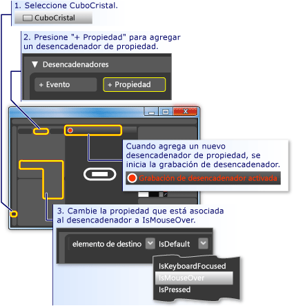  
  
3.  **IsMouseOver activa una opacidad del 100% para CuboCristal:** observe el estado **Grabación de desencadenador activada** \(consulte la ilustración anterior\).  Esto significa que cualquier cambio que realice en los valores de propiedad de **CuboCristal** mientras la grabación esté activada se convertirá en una acción que tendrá lugar cuando <xref:System.Windows.UIElement.IsMouseOver%2A> sea `true`.  Durante la grabación, cambie el valor de la propiedad <xref:System.Windows.UIElement.Opacity%2A> de **CuboCristal** a 100%.  
  
       
  
     Acaba de crear su primer desencadenador de propiedad.  Observe que el panel **Desencadenadores** del editor ha grabado el cambio de <xref:System.Windows.UIElement.Opacity%2A> al 100%.  
  
     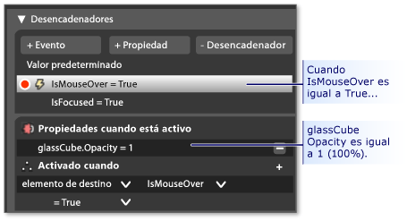  
  
     Presione F5 para ejecutar la aplicación y pase el puntero por encima del botón.  Debería ver cómo aparece la capa de cristal cuando el puntero está sobre el botón y cómo desaparece al quitarlo de encima.  
  
4.  **IsMouseOver desencadena un cambio de valor del trazo:** procedamos a asociar otras acciones al desencadenador <xref:System.Windows.UIElement.IsMouseOver%2A>.  Mientras la grabación continúa, cambie la selección de **CuboCristal** a **RectánguloExterior**.  A continuación, establezca la propiedad <xref:System.Windows.Shapes.Shape.Stroke%2A> de **RectánguloExterior** en la expresión personalizada "{DynamicResource {x:Static SystemColors.HighlightBrushKey}}".  De esta forma, el valor de la propiedad <xref:System.Windows.Shapes.Shape.Stroke%2A> se establece en el color de resaltado típico que se utiliza en los botones.  Presione F5 para ver lo que ocurre al pasar el puntero sobre el botón.  
  
     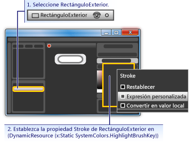  
  
5.  **IsMouseOver activa el texto borroso:** asociemos ahora otra acción al desencadenador de la propiedad <xref:System.Windows.UIElement.IsMouseOver%2A>.  Haga que el contenido del botón se vea un poco borroso cuando el cristal aparezca sobre él.  Para ello, podemos aplicar un efecto <xref:System.Windows.Media.Effects.BitmapEffect> de desenfoque al control <xref:System.Windows.Controls.ContentPresenter> \(**MiContentPresenter**\).  
  
       
  
    > [!NOTE]
    >  Para devolver al panel **Propiedades** el estado que tenía antes de iniciar la búsqueda de <xref:System.Windows.Media.Effects.BitmapEffect>, borre el texto del cuadro **Buscar**.  
  
     Llegados a este punto, hemos utilizado un desencadenador de propiedad con varias acciones asociadas para crear un comportamiento de resaltado cuando el puntero entra y sale del área del botón.  Otro comportamiento típico de un botón es permanecer resaltado cuando tiene el foco \(como ocurre después de hacer clic en él\).  Podemos agregar dicho comportamiento agregando otro desencadenador de propiedad para la propiedad <xref:System.Windows.UIElement.IsFocused%2A>.  
  
6.  **Cree un desencadenador de propiedad para IsFocused:** utilizando el mismo procedimiento que para <xref:System.Windows.UIElement.IsMouseOver%2A> \(consulte el primer paso de esta sección\), cree otro desencadenador de propiedad para la propiedad <xref:System.Windows.UIElement.IsFocused%2A>.  Desde el estado **Grabación de desencadenador activada**, agregue las acciones siguientes al desencadenador:  
  
    -   Para **CuboCristal**, <xref:System.Windows.UIElement.Opacity%2A> se establece en el 100%.  
  
    -   Para **RectánguloExterior**, <xref:System.Windows.Shapes.Shape.Stroke%2A> se establece en el valor de expresión personalizada "{DynamicResource {x:Static SystemColors.HighlightBrushKey}}".  
  
 Como último paso de este tutorial, agregaremos animaciones al botón.  Las animaciones se desencadenarán a través de eventos, en concreto los eventos <xref:System.Windows.UIElement.MouseEnter> y <xref:System.Windows.Controls.Primitives.ButtonBase.Click>.  
  
#### Para utilizar desencadenadores de eventos y animaciones a fin de aportar interactividad  
  
1.  **Cree un desencadenador de eventos MouseEnter:** agregue un nuevo desencadenador de eventos y seleccione <xref:System.Windows.UIElement.MouseEnter> como el evento que se utilizará en el desencadenador.  
  
     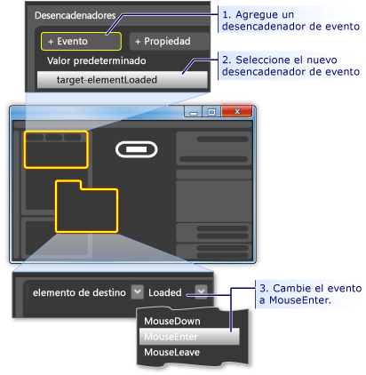  
  
2.  **Cree una escala de tiempo de animación:** a continuación, asocie una escala de tiempo de animación al evento <xref:System.Windows.UIElement.MouseEnter>.  
  
     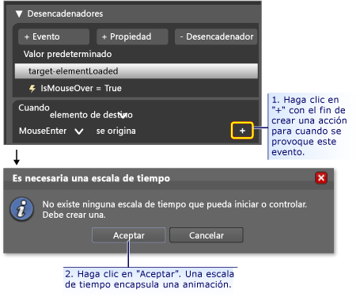  
  
     Después de presionar **Aceptar** para crear una nueva escala de tiempo, aparecerá un panel **Escala de tiempo** y se mostrará el mensaje "Grabación de escala de tiempo activada" en el panel de diseño.  Esto significa que se pueden comenzar a grabar cambios de propiedades en la escala de tiempo \(animar cambios de propiedades\).  
  
    > [!NOTE]
    >  Es posible que necesite cambiar el tamaño de la ventana o de los paneles para ver la presentación.  
  
       
  
3.  **Cree un fotograma clave:** para crear una animación, seleccione el objeto que desea animar, cree dos o más fotogramas clave en la escala de tiempo y establezca los valores de propiedad entre los que desea que interpole la animación para dichos fotogramas clave.  Utilice la ilustración siguiente como guía para la creación de un fotograma clave.  
  
     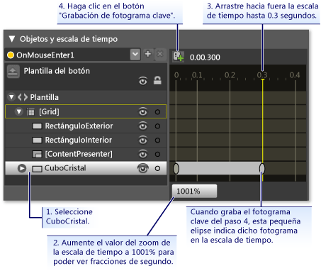  
  
4.  **Reduzca CuboCristal en este fotograma clave:** con el segundo fotograma clave seleccionado, reduzca el tamaño de **CuboCristal** al 90% de su tamaño total utilizando la **Transformación de tamaño**.  
  
     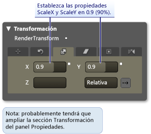  
  
     Presione F5 para ejecutar la aplicación.  Mueva el puntero sobre el botón.  Observe que la capa de cristal se reduce en la parte superior del botón.  
  
5.  **Cree otro desencadenador de eventos y asocie otra animación al mismo:** agreguemos una animación más.  Utilice un procedimiento similar al que empleó para crear la animación del desencadenador de eventos anterior:  
  
    1.  Cree un nuevo desencadenador de eventos mediante el evento <xref:System.Windows.Controls.Primitives.ButtonBase.Click>.  
  
    2.  Asocie una nueva escala de tiempo al evento <xref:System.Windows.Controls.Primitives.ButtonBase.Click>.  
  
     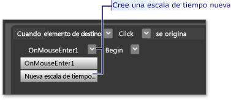  
  
    1.  Para esta escala de tiempo, cree dos fotogramas clave, uno a los 0,0 segundos y el otro a los 0,3 segundos.  
  
    2.  Con el fotograma clave de los 0,3 segundos resaltado, establezca el **Ángulo de giro** en 360 grados.  
  
       
  
    1.  Presione F5 para ejecutar la aplicación.  Haga clic en el botón.  Observe que la capa de cristal gira sobre sí misma.  
  
## Conclusión  
 Ya ha completado el botón personalizado.  Para ello, ha utilizado una plantilla de botón que se aplicaba a todos los botones de la aplicación.  Si sale del modo de edición de plantillas \(consulte la ilustración siguiente\) y crea más botones, verá que se parecen y se comportan como el botón personalizado en lugar de como el botón predeterminado.  
  
 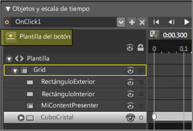  
  
   
  
 Presione F5 para ejecutar la aplicación.  Haga clic en los botones y observe cómo todos ellos se comportan del mismo modo.  
  
 Recuerde que mientras estaba personalizando la plantilla, estableció la propiedad <xref:System.Windows.Shapes.Shape.Fill%2A> de **RectánguloInterior** y la propiedad <xref:System.Windows.Shapes.Shape.Stroke%2A> de **RectánguloExterior** en el fondo de plantilla \({Fondo de TemplateBinding}\).  Por ello, cuando establezca el color de fondo de los botones individuales, el fondo que estableció se utilizará para las propiedades respectivas.  Pruebe a cambiar los fondos ahora.  En la ilustración siguiente, se utilizan distintos degradados.  Por lo tanto, aunque una plantilla sea útil para realizar una personalización global de controles como los botones, los controles basados en plantillas también pueden modificarse para que sean distintos entre sí.  
  
   
  
 En resumen, durante el proceso de personalización de una plantilla de botón ha aprendido a hacer lo siguiente en Microsoft Expression Blend:  
  
-   Personalizar el aspecto de un control.  
  
-   Establecer desencadenadores de propiedad.  Los desencadenadores de propiedad resultan muy útiles ya que pueden utilizarse en la mayoría de los objetos, no sólo en los controles.  
  
-   Establecer desencadenadores de eventos.  Los desencadenadores de eventos resultan muy útiles porque pueden utilizarse en la mayoría de los objetos, no sólo en los controles.  
  
-   Crear animaciones.  
  
-   Varios: crear degradados, agregar efectos de mapa de bits, usar transformaciones y establecer propiedades básicas para los objetos.  
  
## Vea también  
 [Crear un botón mediante el uso de XAML](../../../../docs/framework/wpf/controls/walkthrough-create-a-button-by-using-xaml.md)   
 [Aplicar estilos y plantillas](../../../../docs/framework/wpf/controls/styling-and-templating.md)   
 [Información general sobre animaciones](../../../../docs/framework/wpf/graphics-multimedia/animation-overview.md)   
 [Información general sobre el dibujo con colores sólidos y degradados](../../../../docs/framework/wpf/graphics-multimedia/painting-with-solid-colors-and-gradients-overview.md)   
 [Información general sobre efectos de imagen](../../../../docs/framework/wpf/graphics-multimedia/bitmap-effects-overview.md)