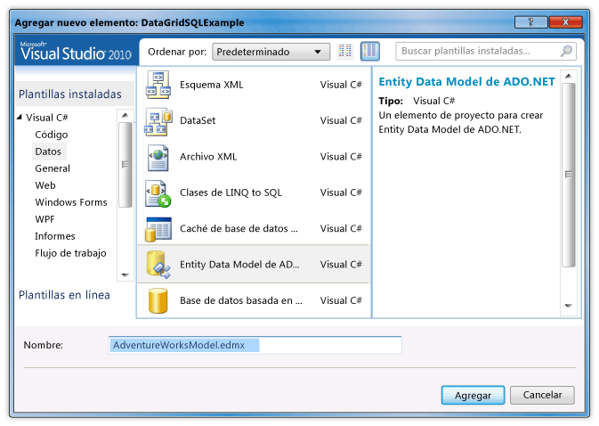
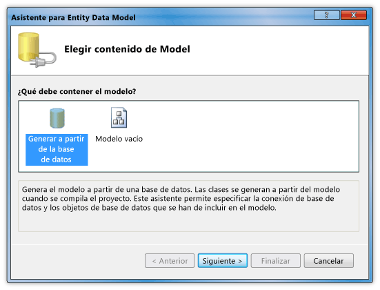
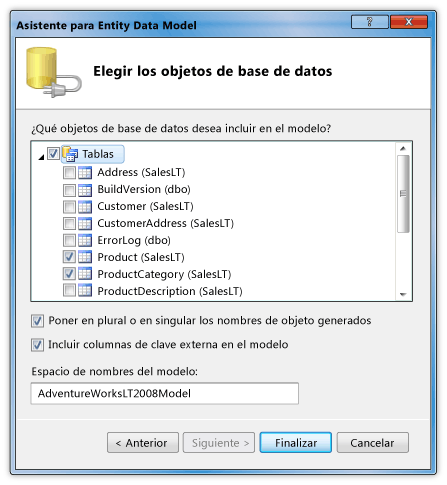

# Tutorial: Mostrar los datos de una base de datos de SQL Server en un control DataGrid
En este tutorial, recuperará datos de una base de datos de SQL Server y mostrará esos datos en un control <xref:System.Windows.Controls.DataGrid>.  Usará ADO.NET Entity Framework para crear las clases de entidad que representan los datos y usará LINQ para escribir una consulta que recupera los datos especificados de una clase de entidad.  
  
## Requisitos previos  
 Necesita los componentes siguientes para completar este tutorial:  
  
-   [!INCLUDE[vs_dev11_long](../../../../includes/vs-dev11-long-md.md)].  
  
-   Acceso a una instancia en ejecución de SQL Server o SQL Server Express que tenga adjunta la base de datos de ejemplo AdventureWorksLT2008.  La base de datos AdventureWorksLT2008 se puede descargar desde el [sitio web de CodePlex](http://go.microsoft.com/fwlink/?LinkId=159848).  
  
### Para crear clases de entidad  
  
1.  Cree un nuevo proyecto de aplicación WPF en Visual Basic o C\# y asígnele el nombre `DataGridSQLExample`.  
  
2.  En el Explorador de soluciones, haga clic con el botón secundario en el proyecto, elija **Agregar** y seleccione **Nuevo elemento**.  
  
     Aparecerá el cuadro de diálogo Agregar nuevo elemento.  
  
3.  En el panel Plantillas instaladas, seleccione **Datos** y, en la lista de plantillas, seleccione **Modelo de datos de entidad de ADO.NET**.  
  
       
  
4.  Asigne al archivo el nombre `AdventureWorksModel.edmx` y haga clic en **Agregar**.  
  
     Aparecerá el Asistente para Entity Data Model.  
  
5.  En la pantalla Elegir contenido de Model, seleccione **Generar desde la base de datos** y haga clic en **Siguiente**.  
  
       
  
6.  En la pantalla Elegir la conexión de datos, proporcione la conexión a la base de datos AdventureWorksLT2008.  Para obtener más información, vea [Cuadro de diálogo Elegir la conexión de datos](http://go.microsoft.com/fwlink/?LinkId=160190).  
  
       
  
7.  Asegúrese de que el nombre sea `AdventureWorksLT2008Entities` y que la casilla **Guardar configuración de conexión de la entidad en App.Config como** esté activada; a continuación, haga clic en **Siguiente**.  
  
8.  En la pantalla Elija los objetos de base de datos, expanda el nodo Tablas, y seleccione las tablas **Product** y **ProductCategory**.  
  
     Puede generar clases de entidad para todas las tablas; sin embargo, en este ejemplo solo recupera datos de esas dos tablas.  
  
       
  
9. Haga clic en **Finalizar**.  
  
     Las entidades Product y ProductCategory se mostrarán en Entity Designer.  
  
       
  
### Para recuperar y presentar los datos  
  
1.  Abra el archivo MainWindow.xaml.  
  
2.  Establezca la propiedad <xref:System.Windows.FrameworkElement.Width%2A> del control <xref:System.Windows.Window> en 450.  
  
3.  En el editor XAML, agregue la siguiente etiqueta <xref:System.Windows.Controls.DataGrid> entre las etiquetas `<Grid>` y `</Grid>` para agregar un objeto <xref:System.Windows.Controls.DataGrid> denominado `dataGrid1`.  
  
     [!code-xml[DataGrid_SQL_EF_Walkthrough#3](../../../../samples/snippets/csharp/VS_Snippets_Wpf/DataGrid_SQL_EF_Walkthrough/CS/MainWindow.xaml#3)]  
  
       
  
4.  Seleccione <xref:System.Windows.Window>.  
  
5.  Usando la ventana Propiedades o el editor XAML, cree un controlador de eventos para <xref:System.Windows.Window> denominado `Window_Loaded` para el evento <xref:System.Windows.FrameworkElement.Loaded>.  Para obtener más información, vea [Cómo: Crear controladores de eventos simples](http://msdn.microsoft.com/es-es/b1456e07-9dec-4354-99cf-18666b64f480).  
  
     A continuación se muestra el código XAML para MainWindow.xaml.  
  
    > [!NOTE]
    >  Si usa Visual Basic, en la primera línea de MainWindow.xaml, reemplace `x:Class="DataGridSQLExample.MainWindow"` por `x:Class="MainWindow"`.  
  
     [!code-xml[DataGrid_SQL_EF_Walkthrough#1](../../../../samples/snippets/csharp/VS_Snippets_Wpf/DataGrid_SQL_EF_Walkthrough/CS/MainWindow.xaml#1)]  
  
6.  Abra el archivo de código subyacente \(MainWindow.xaml.vb o MainWindow.xaml.cs\) para <xref:System.Windows.Window>.  
  
7.  Agregue el código siguiente para recuperar solo determinados valores de las tablas combinadas y establecer la propiedad <xref:System.Windows.Controls.ItemsControl.ItemsSource%2A> de <xref:System.Windows.Controls.DataGrid> en los resultados de la consulta.  
  
     [!code-csharp[DataGrid_SQL_EF_Walkthrough#2](../../../../samples/snippets/csharp/VS_Snippets_Wpf/DataGrid_SQL_EF_Walkthrough/CS/MainWindow.xaml.cs#2)]
     [!code-vb[DataGrid_SQL_EF_Walkthrough#2](../../../../samples/snippets/visualbasic/VS_Snippets_Wpf/DataGrid_SQL_EF_Walkthrough/VB/MainWindow.xaml.vb#2)]  
  
8.  Ejecute el ejemplo.  
  
     Debe aparecer un control <xref:System.Windows.Controls.DataGrid> que muestre datos.  
  
       
  
## Pasos siguientes  
  
## Vea también  
 <xref:System.Windows.Controls.DataGrid>   
 [Cómo se hago: ¿Primeros pasos con Entity Framework en aplicaciones WPF?](http://go.microsoft.com/fwlink/?LinkId=159868)