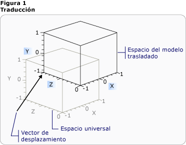
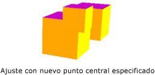
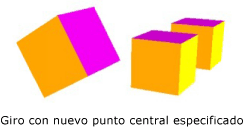
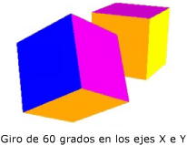

# Informaci&#243;n general sobre transformaciones de modelos 3D
En este tema se describe cómo aplicar las transformaciones a los modelos 3D del sistema de gráficos de [!INCLUDE[TLA#tla_winclient](../../../../includes/tlasharptla-winclient-md.md)].  Las transformaciones permiten que el programador cambie la posición y el tamaño de los modelos, así como que los vuelva a orientar sin cambiar los valores base que los definen.  
  
 [!INCLUDE[autoOutline](../Token/autoOutline_md.md)]  
  
## Espacio de coordenadas 3D  
 El contenido de los gráficos 3D de [!INCLUDE[TLA#tla_winclient](../../../../includes/tlasharptla-winclient-md.md)] se encapsula en un elemento, <xref:System.Windows.Controls.Viewport3D>, que puede participar en la estructura de elementos bidimensionales.  El sistema de gráficos trata los objetos Viewport3D como elementos visuales bidimensionales, al igual que ocurre con muchos otros elementos de [!INCLUDE[TLA#tla_winclient](../../../../includes/tlasharptla-winclient-md.md)].  Viewport3D funciona como ventana \(una ventanilla\) de una escena tridimensional.  Más concretamente, es una superficie en la que se proyecta una escena 3D.  Aunque puede usar Viewport3D con otros objetos de dibujo 2D en el mismo gráfico de escena, no puede combinar objetos 2D y 3D en un Viewport3D.  El elemento Viewport3D contiene el espacio de coordenadas descrito en la siguiente descripción.  
  
 El sistema de coordenadas de [!INCLUDE[TLA#tla_winclient](../../../../includes/tlasharptla-winclient-md.md)] de gráficos 2D busca el origen en la parte superior izquierda de la superficie de representación, que suele ser la pantalla.  En el sistema 2D, los valores positivos del eje X se extienden hacia la derecha y los del eje Y, hacia abajo.  En el sistema de coordenadas 3D, sin embargo, el origen se encuentra en el centro del área de la pantalla, los valores positivos del eje X se extienden hacia la derecha, los del eje Y, hacia arriba \(no hacia abajo\) y los del eje Z, hacia el exterior partiendo del origen; es decir, hacia el lector.  
  
   
Coordinar la comparación de sistemas  
  
 El espacio definido por estos ejes es el marco estático de referencia de los objetos 3D de [!INCLUDE[TLA#tla_winclient](../../../../includes/tlasharptla-winclient-md.md)].  Cuando se generan modelos en este espacio y se crean luces y cámaras para verlos, es útil distinguir este marco estático de referencia, o "espacio universal", del marco de referencia local creado para cada modelo al aplicarle transformaciones.  Recuerde también que los objetos del espacio universal podrían parecer completamente diferentes, o incluso no verse en absoluto, dependiendo de la configuración de las luces y la cámara, pero que la posición de la cámara no cambia la ubicación de los objetos en el espacio universal.  
  
## Transformar modelos  
 Al crear modelos, éstos tienen una ubicación determinada en la escena.  Para mover esos modelos por la escena, girarlos o cambiar su tamaño, no es práctico cambiar los vértices que definen los propios modelos.  En su lugar, al igual que en 2D, se aplican transformaciones a los modelos.  
  
 Cada objeto del modelo tiene una propiedad <xref:System.Windows.Media.Media3D.Model3D.Transform%2A> con la que puede mover, reorientar o cambiar el tamaño del modelo.  Al aplicar una transformación, en realidad lo que se hace es desplazar todos los puntos del modelo según un vector o valor especificado por la transformación.  Es decir, se transforma el espacio de coordenadas en el que se ha definido el modelo \("espacio del modelo"\), pero no se cambian los valores que constituyen la geometría del modelo en el sistema de coordenadas de la escena completa \("espacio universal"\).  
  
## Transformaciones de la traslación  
 Las transformaciones 3D heredan de la clase base abstracta <xref:System.Windows.Media.Media3D.Transform3D>; se incluyen las clases de transformaciones afines <xref:System.Windows.Media.Media3D.TranslateTransform3D>, <xref:System.Windows.Media.Media3D.ScaleTransform3D> y <xref:System.Windows.Media.Media3D.RotateTransform3D>.  El sistema 3D de [!INCLUDE[TLA#tla_winclient](../../../../includes/tlasharptla-winclient-md.md)] también proporciona una clase <xref:System.Windows.Media.Media3D.MatrixTransform3D> que permite especificar las mismas transformaciones en operaciones de matrices más precisas.  
  
 <xref:System.Windows.Media.Media3D.TranslateTransform3D> mueve todos los puntos de Model3D en la dirección del vector de desplazamiento que especifique con las propiedades <xref:System.Windows.Media.Media3D.TranslateTransform3D.OffsetX%2A>, <xref:System.Windows.Media.Media3D.TranslateTransform3D.OffsetY%2A> y <xref:System.Windows.Media.Media3D.TranslateTransform3D.OffsetZ%2A>.  Por ejemplo, dado un vértice de un cubo en \(2,2,2\), un vector de desplazamiento de \(0,1.6,1\) movería el vértice \(2,2,2\) a \(2,3.6,3\).  El vértice del cubo sigue siendo \(2,2,2\) en el espacio del modelo, pero ahora dicho espacio ha cambiado su relación al espacio universal, de tal forma que \(2,2,2\) en el espacio del modelo es \(2,3.6,3\) en el espacio universal.  
  
   
Traslación con desplazamiento  
  
 En los ejemplos de código siguientes, se muestra cómo aplicar una traslación.  
  
 [!code-xml[animation3dgallery_snip#Translation3DAnimationExampleWholePage](../../../../samples/snippets/csharp/VS_Snippets_Wpf/Animation3DGallery_snip/CS/Translation3DAnimationExample.xaml#translation3danimationexamplewholepage)]  
  
## Transformaciones de escala  
 <xref:System.Windows.Media.Media3D.ScaleTransform3D> cambia la escala del modelo mediante un vector de escala especificado respecto a un punto central.  Especifique una escala uniforme, que escala el modelo mediante el mismo valor en los ejes X, Y y Z, para cambiar proporcionalmente el tamaño del modelo.  Por ejemplo, si se establece el valor de las propiedades <xref:System.Windows.Media.ScaleTransform.ScaleX%2A>, <xref:System.Windows.Media.ScaleTransform.ScaleY%2A> y <xref:System.Windows.Media.Media3D.ScaleTransform3D.ScaleZ%2A> de la transformación en mitades de 0,5 del tamaño del modelo; al establecer el valor de las mismas propiedades en 2 se duplica su escala en los tres ejes.  
  
   
Ejemplo de ScaleVector  
  
 Si se especifica una transformación de escala no uniforme \(una transformación de escala cuyos valores X, Y y Z no son iguales\), se puede provocar el estiramiento o la contracción del modelo en una o dos dimensiones sin afectar el resto.  Por ejemplo, si se establece el valor de <xref:System.Windows.Media.ScaleTransform.ScaleX%2A> en 1, de <xref:System.Windows.Media.ScaleTransform.ScaleY%2A> en 2 y de <xref:System.Windows.Media.Media3D.ScaleTransform3D.ScaleZ%2A> en 1, se provocaría la duplicación del alto del modelo transformado pero los ejes X y Z permanecerían iguales.  
  
 De forma predeterminada, ScaleTransform3D provoca la expansión o contracción de los vértices en el origen \(0,0,0\).  Si el modelo que desea transformar no se dibuja partiendo del origen, sin embargo, al escalar el modelo a partir del origen, no se escalará el modelo "en contexto". En su lugar, cuando se multiplican los vértices del modelo por el vector de escala, la operación de la escala tendrá el efecto de trasladar y escalar el modelo.  
  
   
Ejemplo de ScaleCenter  
  
 Para escalar un modelo "en contexto", especifique el centro del mismo estableciendo el valor de las propiedades <xref:System.Windows.Media.ScaleTransform.CenterX%2A>, <xref:System.Windows.Media.ScaleTransform.CenterY%2A> y <xref:System.Windows.Media.Media3D.ScaleTransform3D.CenterZ%2A> de ScaleTransform3D.  De esta forma, se asegura de que el sistema de gráficos escala el espacio del modelo y, a continuación, lo traslada para centrarse en el objeto <xref:System.Windows.Media.Media3D.Point3D>especificado.  A la inversa, si ha compilado el modelo en el origen y ha especificado un punto central diferente, espere ver el modelo trasladado fuera del origen.  
  
## Transformaciones de giro  
 Puede girar un modelo 3D de varias maneras diferentes.  Una transformación de giro típica especifica un eje y un ángulo de giro alrededor de ese eje.  La clase <xref:System.Windows.Media.Media3D.RotateTransform3D> permite definir un objeto <xref:System.Windows.Media.Media3D.Rotation3D> con su propiedad <xref:System.Windows.Media.Media3D.RotateTransform3D.Rotation%2A>.  Después especifique las propiedades <xref:System.Windows.Media.Media3D.AxisAngleRotation3D.Axis%2A> y <xref:System.Windows.Media.Media3D.AxisAngleRotation3D.Angle%2A> en Rotation3D, en este caso un objeto <xref:System.Windows.Media.Media3D.AxisAngleRotation3D>, para definir la transformación.  En los ejemplos siguientes, se gira un modelo 60 grados sobre el eje Y.  
  
 [!code-xml[animation3dgallery_snip#Rotate3DUsingAxisAngleRotation3DExampleWholePage](../../../../samples/snippets/csharp/VS_Snippets_Wpf/Animation3DGallery_snip/CS/Rotat3DUsingAxisAngleRotation3DExample.xaml#rotate3dusingaxisanglerotation3dexamplewholepage)]  
  
 Nota: 3D de [!INCLUDE[TLA#tla_winclient](../../../../includes/tlasharptla-winclient-md.md)] es un sistema a la derecha, es decir, un valor angular positivo de un giro tiene como resultado un giro en el sentido contrario a las agujas del reloj sobre el eje.  
  
 Los giros angulares del eje presuponen el giro sobre el origen si no se especifica ningún valor para las propiedades <xref:System.Windows.Media.Media3D.RotateTransform3D.CenterX%2A>, <xref:System.Windows.Media.Media3D.RotateTransform3D.CenterY%2A> y <xref:System.Windows.Media.Media3D.RotateTransform3D.CenterZ%2A> en RotateTransform3D.  Como ocurre con el escalado, es útil recordar que el giro transforma el espacio de coordenadas de todo el modelo.  Si el modelo no se creó sobre el origen, o se ha trasladado previamente, el giro podría "pivotar" sobre el origen en lugar de girar en contexto.  
  
   
Giro con un nuevo centro especificado  
  
 Para girar el modelo "en contexto", especifique el centro real del modelo como el centro de giro.  Puesto que la geometría se suele modelar en el origen, la mayor parte de las veces puede obtener el resultado esperado de un conjunto de transformaciones si primero ajusta el tamaño del modelo \(lo escala\), después establece su orientación \(lo gira\) y, finalmente, lo mueve a la ubicación deseada \(lo traslada\).  
  
   
Ejemplo de giro  
  
 Los giros angulares sobre el eje funcionan bien para las transformaciones estáticas y algunas animaciones.  Sin embargo, considere girar un modelo de cubo 60 grados sobre el eje X y, a continuación, 45 grados sobre el eje Z.  Puede describir esta transformación como dos transformaciones afines discretas o como matriz.  Sin embargo, quizá sea difícil animar un giro definido así de forma continua.  Aunque las posiciones inicial y final del modelo, calculadas mediante cualquiera de los enfoque son las mismas, varía el cálculo de las posiciones intermedias tomadas por el modelo.  Los cuaterniones representan una forma alternativa de calcular la interpolación entre el inicio y el fin de un giro.  
  
 Un cuaternión representa un eje en el espacio 3D y un giro alrededor de ese eje.  Por ejemplo, un cuaternión puede que represente un eje \(1,1,2\) y un giro de 50 grados.  La capacidad de los cuaterniones al definir los giros procede de las dos operaciones que puede realizar en ellos: composición e interpolación.  La composición de dos cuaterniones aplicada a una geometría significa "girar la geometría sobre el eje2 mediante giro2, después girarla sobre el eje1 mediante giro1". Utilizando la composición, puede combinar los dos giros en la geometría para obtener un solo cuaternión que representa el resultado.  Puesto que la interpolación del cuaternión puede calcular una ruta de acceso continuada y correcta desde un eje y la orientación a otro, puede interpolar desde el cuaternión original al compuesto para lograr una transición continuada de uno a otro, permitiéndole animar la transformación.  En los modelos que desee animar, puede especificar un objeto <xref:System.Windows.Media.Media3D.Quaternion> de destino para el giro utilizando <xref:System.Windows.Media.Media3D.QuaternionRotation3D> para la propiedad <xref:System.Windows.Media.Media3D.RotateTransform3D.Rotation%2A>.  
  
## Usar colecciones de transformaciones  
 Al compilar una escena, es normal aplicar más de una transformación a un modelo.  Agregue transformaciones a la colección de la propiedad <xref:System.Windows.Media.Media3D.Transform3DGroup.Children%2A> de la clase <xref:System.Windows.Media.Media3D.Transform3DGroup> para agrupar transformaciones convenientemente con el fin de aplicarlas a diversos modelos de la escena.  A menudo es conveniente volver a usar una transformación en varios grupos diferentes, de la misma forma que puede volver a usar un modelo aplicando un conjunto diferente de transformaciones a cada instancia.  Observe que el orden en el que las transformaciones se agregan a la colección es importante: las transformaciones de la colección se aplican de la primera a la última.  
  
## Animar transformaciones  
 La implementación 3D de [!INCLUDE[TLA#tla_winclient](../../../../includes/tlasharptla-winclient-md.md)] utiliza el mismo sistema de control de tiempo y animación que los gráficos 2D.  En otras palabras, para animar una escena 3D, se animan las propiedades de sus modelos.  Es posible animar directamente las propiedades de los elementos primitivos, pero suele ser más fácil animar las transformaciones que cambian la posición o el aspecto de los modelos.  Puesto que las transformaciones se pueden aplicar a los objetos <xref:System.Windows.Media.Media3D.Model3DGroup>, así como a los modelos individuales, es posible aplicar un conjunto de animaciones a los elementos secundarios de Model3DGroup y otro conjunto de animaciones a un grupo de objetos.  Para obtener información general sobre el sistema de control de tiempo y animación de [!INCLUDE[TLA#tla_winclient](../../../../includes/tlasharptla-winclient-md.md)], vea los temas [Información general sobre animaciones](../../../../docs/framework/wpf/graphics-multimedia/animation-overview.md) y [Información general sobre objetos Storyboard](../../../../docs/framework/wpf/graphics-multimedia/storyboards-overview.md).  
  
 Para animar un objeto en [!INCLUDE[TLA#tla_winclient](../../../../includes/tlasharptla-winclient-md.md)], cree una escala de tiempo, defina una animación \(que, en realidad, es un cambio de algún valor de propiedad con el transcurso del tiempo\) y especifique la propiedad a la que desea aplicar la animación.  Esta propiedad debe ser una propiedad de FrameworkElement.  Puesto que todos los objetos de una escena 3D son elementos secundarios de Viewport3D, las propiedades de destino de cualquier animación que desee aplicar a la escena son propiedades de propiedades de Viewport3D.  Es importante obtener la ruta de acceso de la propiedad de la animación correctamente, ya que la sintaxis puede ser prolija.  
  
 Suponga desea girar un objeto en contexto, pero también aplicar un movimiento oscilante para que se vean más partes del objeto.  Podría aplicar RotateTransform3D al modelo y animar el eje de giro de un vector a otro.  En el ejemplo de código siguientes, se muestra la aplicación de <xref:System.Windows.Media.Animation.Vector3DAnimation> a una propiedad Axis de Rotation3D de la transformación, presuponiendo que RotateTransform3D es una de las diversas transformaciones aplicadas al modelo con <xref:System.Windows.Media.TransformGroup>.  
  
 [!code-csharp[3doverview#3DOverview3DN1](../../../../samples/snippets/csharp/VS_Snippets_Wpf/3DOverview/CSharp/Window1.xaml.cs#3doverview3dn1)]
 [!code-vb[3doverview#3DOverview3DN1](../../../../samples/snippets/visualbasic/VS_Snippets_Wpf/3DOverview/visualbasic/window1.xaml.vb#3doverview3dn1)]  
  
 [!code-csharp[3doverview#3DOverview3DN3](../../../../samples/snippets/csharp/VS_Snippets_Wpf/3DOverview/CSharp/Window1.xaml.cs#3doverview3dn3)]
 [!code-vb[3doverview#3DOverview3DN3](../../../../samples/snippets/visualbasic/VS_Snippets_Wpf/3DOverview/visualbasic/window1.xaml.vb#3doverview3dn3)]  
  
 Utilice una sintaxis similar para que otras propiedades de la transformación muevan o escalen el objeto.  Por ejemplo, podría aplicar <xref:System.Windows.Media.Animation.Point3DAnimation> a la propiedad ScaleCenter en una transformación de escala para que un modelo distorsione su forma continuadamente.  
  
 Aunque los ejemplos anteriores transforman las propiedades de <xref:System.Windows.Media.Media3D.GeometryModel3D>, también es posible transformar las propiedades de otros modelos de la escena.  Animando translaciones aplicadas a objetos Light, por ejemplo, puede crear luz en movimiento y efectos de sombra que pueden cambiar el aspecto de los modelos espectacularmente.  
  
 Puesto que las cámaras también son modelos, igualmente se pueden transformar las propiedades de la cámara.  Puesto que puede cambiar el aspecto de la escena transformando la ubicación de la cámara o las distancias de los planos \(de hecho, transformando toda la proyección de la escena\), tenga en cuenta que la mayoría de los efectos obtenidos de esta forma quizá no tengan tanto "sentido visual" para el lector como las transformaciones aplicadas a la ubicación o posición de los modelos de la escena.  
  
## Vea también  
 [Información general sobre gráficos 3D](../../../../docs/framework/wpf/graphics-multimedia/3-d-graphics-overview.md)   
 [Información general sobre transformaciones](../../../../docs/framework/wpf/graphics-multimedia/transforms-overview.md)   
 [Ejemplo 2\-D Transforms](http://go.microsoft.com/fwlink/?LinkID=158252)