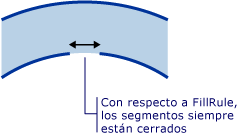

# C&#243;mo: Controlar el relleno de una forma compuesta
El <xref:System.Windows.Media.GeometryGroup.FillRule%2A> propiedad de un <xref:System.Windows.Media.GeometryGroup> o un <xref:System.Windows.Media.PathGeometry>, especifica una "regla" que la forma compuesta utiliza para determinar si un punto determinado forma parte de la geometría. Hay dos valores posibles para <xref:System.Windows.Media.FillRule>: <xref:System.Windows.Media.FillRule> y <xref:System.Windows.Media.FillRule>. Las secciones siguientes se describe cómo utilizar estas dos reglas.  
  
 **EvenOdd:** esta regla determina si un punto está en la región de relleno dibujando un rayo desde ese punto al infinito en cualquier dirección y contando el número de segmentos de ruta de acceso dentro de la forma especificada que cruza el rayo. Si este número es impar, el punto está dentro; si es par, el punto está fuera.  
  
 Por ejemplo, el siguiente código XAML crea una forma compuesta formada por una serie de anillos concéntricos (destino) con un <xref:System.Windows.Media.GeometryGroup.FillRule%2A> establecido en <xref:System.Windows.Media.FillRule>.  
  
 [!code-xml[GeometriesMiscSnippets_snip#FillRuleEvenOddValue](../../../../samples/snippets/xaml/VS_Snippets_Wpf/GeometriesMiscSnippets_snip/XAML/FillRuleExample.xaml#fillruleevenoddvalue)]  
  
 La siguiente ilustración muestra la forma creada en el ejemplo anterior.  
  
   
  
 En la ilustración anterior, observe que no se rellenan el centro y el anillo 3. Esto es porque un rayo dibujado desde cualquier punto dentro de esos dos anillos pasa a través de un número par de segmentos. Vea la ilustración siguiente:  
  
   
  
 **NonZero:** esta regla determina si un punto está en la región de relleno del trazado dibujando un rayo desde ese punto al infinito en cualquier dirección y examinando después los lugares donde un segmento de la forma cruza el rayo. A partir de cero, agregue uno cada vez que un segmento cruza el rayo de izquierda a derecha y se resta uno cada vez una ruta de acceso segmento cruza el rayo de derecha a izquierda. Después de contar el número de veces que cruza, si el resultado es cero, el punto está fuera del trazado. De lo contrario, está dentro.  
  
 [!code-xml[GeometriesMiscSnippets_snip#FillRuleNonZeroValueEllipseGeometry](../../../../samples/snippets/xaml/VS_Snippets_Wpf/GeometriesMiscSnippets_snip/XAML/FillRuleExample.xaml#fillrulenonzerovalueellipsegeometry)]  
  
 En el ejemplo anterior, un valor de <xref:System.Windows.Media.FillRule> de <xref:System.Windows.Media.GeometryGroup.FillRule%2A> da como resultado de la siguiente ilustración:  
  
   
  
 Como puede ver, se rellenan todos los anillos. Esto es porque todos los segmentos se ejecutan en la misma dirección de modo que un rayo dibujado desde cualquier punto cruzará uno o más segmentos y la suma de las veces que cruza no será igual a cero. Por ejemplo, en la ilustración siguiente, las flechas rojas representan la dirección en que se dibujan los segmentos y la flecha blanca representa un rayo arbitrario trazado desde un punto en el anillo más profundo. A partir de un valor de cero, para cada segmento que cruza el rayo, se agrega un valor de uno porque el segmento cruza el rayo de izquierda a derecha.  
  
   
  
 Para mostrar mejor el comportamiento de <xref:System.Windows.Media.FillRule> es necesaria una forma más compleja con segmentos que se ejecutan en diferentes direcciones de la regla. El código XAML siguiente crea una forma similar que el ejemplo anterior, excepto en que se crea con un <xref:System.Windows.Media.PathGeometry> en lugar de tener un <xref:System.Windows.Media.EllipseGeometry> en su lugar, a continuación, lo que crea cuatro arcos concéntricos cerrado completamente círculos concéntricos.  
  
 [!code-xml[GeometriesMiscSnippets_snip#FillRuleNonZeroValuePathGeometry](../../../../samples/snippets/xaml/VS_Snippets_Wpf/GeometriesMiscSnippets_snip/XAML/FillRuleExample.xaml#fillrulenonzerovaluepathgeometry)]  
  
 La siguiente ilustración muestra la forma creada en el ejemplo anterior.  
  
   
  
 Observe que no se llena el tercer arco contando desde el centro. La siguiente ilustración muestra por qué se trata. En la ilustración, las flechas rojas representan la dirección en que se dibujan los segmentos. Las dos flechas blancas representan dos rayos arbitrarios que parten desde un punto en la región "no rellena". Como puede observarse en la ilustración, la suma de los valores de un rayo determinado que cruza los segmentos en su ruta de acceso es cero. Como se definió anteriormente, una suma de cero significa que el punto no forma parte de la geometría (no es parte del relleno) mientras la suma es *no* cero, incluido un valor negativo, forma parte de la geometría.  
  
   
  
 **Nota:** para los fines de <xref:System.Windows.Media.FillRule>, todas las formas se consideran cerradas. Si hay un intervalo en un segmento, dibuje una línea imaginaria para cerrarlo. En el ejemplo anterior, hay huecos pequeños de los anillos. Por tanto, podría esperar que un rayo que se ejecuta a través de la brecha para ofrecer un resultado diferente, a continuación, en un radio que se ejecuta en otra dirección. A continuación se muestra una ilustración ampliada de uno de estos espacios en blanco y el "segmento imaginario" (segmento que se dibuja con fines de aplicar el <xref:System.Windows.Media.FillRule>) que lo cierra.  
  
   
  
## Ejemplo  
  
## Vea también  
 [Crear una forma compuesta](../../../../docs/framework/wpf/graphics-multimedia/how-to-create-a-composite-shape.md)   
 [Información general sobre geometría](../../../../docs/framework/wpf/graphics-multimedia/geometry-overview.md)