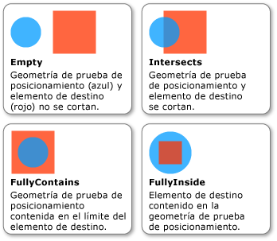

# C&#243;mo: Realizar una prueba de posicionamiento usando Geometry como par&#225;metro
En este ejemplo se muestra cómo realizar una [prueba de posicionamiento](GTMT) en un objeto visual utilizando un objeto <xref:System.Windows.Media.Geometry> como parámetro de prueba de posicionamiento.  
  
## Ejemplo  
 En el ejemplo siguiente se muestra cómo configurar una prueba de posicionamiento utilizando <xref:System.Windows.Media.GeometryHitTestParameters> para el método <xref:System.Windows.Media.VisualTreeHelper.HitTest%2A>.  El valor de <xref:System.Windows.Point> que se pasa al método `OnMouseDown` se utiliza para crear un objeto <xref:System.Windows.Media.Geometry> con el fin de expandir el intervalo de la prueba de posicionamiento.  
  
 [!code-csharp[HitTestingOverview#HitTestingOverviewSnippet10](../../../../samples/snippets/csharp/VS_Snippets_Wpf/HitTestingOverview/CSharp/GeometryHitTest.cs#hittestingoverviewsnippet10)]
 [!code-vb[HitTestingOverview#HitTestingOverviewSnippet10](../../../../samples/snippets/visualbasic/VS_Snippets_Wpf/HitTestingOverview/visualbasic/geometryhittest.vb#hittestingoverviewsnippet10)]  
  
 La propiedad <xref:System.Windows.Media.GeometryHitTestResult.IntersectionDetail%2A> de <xref:System.Windows.Media.GeometryHitTestResult> proporciona información sobre los resultados de una prueba de posicionamiento que utiliza <xref:System.Windows.Media.Geometry> como parámetro.  En la ilustración siguiente se muestra la relación entre la geometría de una prueba de posicionamiento \(círculo azul\) y el contenido representado del objeto visual \(cuadrado rojo\).  
  
   
Intersección entre la geometría de una prueba de posicionamiento y un objeto visual de destino  
  
 En el ejemplo siguiente se muestra cómo implementar una devolución de llamada de prueba de posicionamiento cuando se utiliza <xref:System.Windows.Media.Geometry> como parámetro de prueba de posicionamiento.  El parámetro `result` se convierte en <xref:System.Windows.Media.GeometryHitTestResult> para recuperar el valor de la propiedad <xref:System.Windows.Media.GeometryHitTestResult.IntersectionDetail%2A>.  El valor de propiedad permite determinar si el parámetro de prueba de posicionamiento <xref:System.Windows.Media.Geometry> está incluido total o parcialmente dentro del contenido representado del destino de la prueba de posicionamiento.  En este caso, en el ejemplo de código únicamente se agregan los resultados de pruebas de posicionamiento correspondientes a los objetos visuales que están incluidos totalmente dentro del límite del elemento de destino.  
  
 [!code-csharp[HitTestingOverview#HitTestingOverviewSnippet11](../../../../samples/snippets/csharp/VS_Snippets_Wpf/HitTestingOverview/CSharp/GeometryHitTest.cs#hittestingoverviewsnippet11)]
 [!code-vb[HitTestingOverview#HitTestingOverviewSnippet11](../../../../samples/snippets/visualbasic/VS_Snippets_Wpf/HitTestingOverview/visualbasic/geometryhittest.vb#hittestingoverviewsnippet11)]  
  
> [!NOTE]
>  No debe llamarse a la devolución de llamada de <xref:System.Windows.Media.HitTestResult> cuando el detalle de la intersección es <xref:System.Windows.Media.IntersectionDetail>.  
  
## Vea también  
 [Realizar pruebas de posicionamiento en la capa visual](../../../../docs/framework/wpf/graphics-multimedia/hit-testing-in-the-visual-layer.md)   
 [Geometría de una prueba de posicionamiento en un objeto Visual](../../../../docs/framework/wpf/graphics-multimedia/how-to-hit-test-geometry-in-a-visual.md)