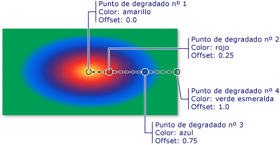

# Cómo: Pintar un área con un degradado radial
En este ejemplo se muestra cómo usar el <xref:System.Windows.Media.RadialGradientBrush> clase para pintar un área con un degradado radial.  
  
## Ejemplo  
 En el ejemplo siguiente se usa un <xref:System.Windows.Media.RadialGradientBrush> para pintar un rectángulo con un degradado radial que realiza la transición de amarillo a rojo a azul para verde lima.  
  
 [!code-csharp[BrushesIntroduction_snip#SimpleRadialGradientExampleWholePage](../../../../samples/snippets/csharp/VS_Snippets_Wpf/BrushesIntroduction_snip/CSharp/RadialGradientBrushSnippet.cs#simpleradialgradientexamplewholepage)]
 [!code-vb[BrushesIntroduction_snip#SimpleRadialGradientExampleWholePage](../../../../samples/snippets/visualbasic/VS_Snippets_Wpf/BrushesIntroduction_snip/visualbasic/radialgradientbrushsnippet.vb#simpleradialgradientexamplewholepage)]
 [!code-xaml[BrushesIntroduction_snip#SimpleRadialGradientExampleWholePage](../../../../samples/snippets/xaml/VS_Snippets_Wpf/BrushesIntroduction_snip/XAML/RadialGradientBrushSnippet.xaml#simpleradialgradientexamplewholepage)]  
  
 La siguiente ilustración muestra el degradado del ejemplo anterior. Se resaltan los delimitadores de degradado.  
  
   
  
> [!NOTE]
>  Los ejemplos de este tema usan el sistema de coordenadas predeterminado para establecer puntos de control. El sistema de coordenadas predeterminado es relativo a un cuadro de límite: 0 indica 0 por ciento del rectángulo, y 1 indica un 100 por cien del rectángulo. Puede cambiar este sistema de coordenadas estableciendo el <xref:System.Windows.Media.GradientBrush.MappingMode%2A> valor para la propiedad <xref:System.Windows.Media.BrushMappingMode.Absolute>. Un sistema de coordenadas absoluto no está relacionado con un rectángulo de selección. Los valores se interpretan directamente en el espacio local.  
  
 Para más <xref:System.Windows.Media.RadialGradientBrush> ejemplos, vea el [Brushes Sample](https://go.microsoft.com/fwlink/?LinkID=159973). Para obtener más información acerca de los degradados y otros tipos de pinceles, vea [el dibujo con colores sólidos y degradados](../../../../docs/framework/wpf/graphics-multimedia/painting-with-solid-colors-and-gradients-overview.md).
