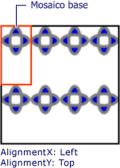

# C&#243;mo: Establecer la alineaci&#243;n horizontal y vertical de TileBrush
En este ejemplo se muestra cómo controlar la alineación horizontal y vertical del contenido de un mosaico.  Para controlar la alineación horizontal y vertical de <xref:System.Windows.Media.TileBrush>, use sus propiedades <xref:System.Windows.Media.TileBrush.AlignmentX%2A> y <xref:System.Windows.Media.TileBrush.AlignmentY%2A>.  
  
 Las propiedades <xref:System.Windows.Media.TileBrush.AlignmentX%2A> y <xref:System.Windows.Media.TileBrush.AlignmentY%2A> de <xref:System.Windows.Media.TileBrush> se usan cuando se cumple cualquiera de estas condiciones:  
  
-   El valor de la propiedad <xref:System.Windows.Media.TileBrush.Stretch%2A> es <xref:System.Windows.Media.Stretch> o <xref:System.Windows.Media.Stretch>, y <xref:System.Windows.Media.TileBrush.Viewbox%2A> y <xref:System.Windows.Media.TileBrush.Viewport%2A> tienen [relaciones de aspecto](GTMT) diferentes.  
  
-   El valor de la propiedad <xref:System.Windows.Media.TileBrush.Stretch%2A> es <xref:System.Windows.Media.Stretch> y <xref:System.Windows.Media.TileBrush.Viewbox%2A> y <xref:System.Windows.Media.TileBrush.Viewport%2A> tienen tamaños diferentes.  
  
## Ejemplo  
 En el ejemplo siguiente se alinea el contenido de <xref:System.Windows.Media.DrawingBrush>, que es un tipo de <xref:System.Windows.Media.TileBrush>, con la esquina superior izquierda de su mosaico.  Para alinear el contenido, el ejemplo establece la propiedad <xref:System.Windows.Media.TileBrush.AlignmentX%2A> de <xref:System.Windows.Media.DrawingBrush> en <xref:System.Windows.Media.AlignmentX> y la propiedad <xref:System.Windows.Media.TileBrush.AlignmentY%2A> en <xref:System.Windows.Media.AlignmentY>.  Este ejemplo produce el siguiente resultado.  
  
   
TileBrush con el contenido alineado con la esquina superior izquierda  
  
 [!code-csharp[brushoverviewexamples_snip#TileBrushTopLeftAlignmentInline](../../../../samples/snippets/csharp/VS_Snippets_Wpf/BrushOverviewExamples_snip/CSharp/TileBrushAlignmentExample.cs#tilebrushtopleftalignmentinline)]
 [!code-vb[brushoverviewexamples_snip#TileBrushTopLeftAlignmentInline](../../../../samples/snippets/visualbasic/VS_Snippets_Wpf/BrushOverviewExamples_snip/visualbasic/tilebrushalignmentexample.vb#tilebrushtopleftalignmentinline)]
 [!code-xml[brushoverviewexamples_snip#TileBrushTopLeftAlignmentInline](../../../../samples/snippets/xaml/VS_Snippets_Wpf/BrushOverviewExamples_snip/XAML/TileBrushAlignmentExample.xaml#tilebrushtopleftalignmentinline)]  
  
## Ejemplo  
 En el ejemplo siguiente se alinea el contenido de <xref:System.Windows.Media.DrawingBrush> con la esquina inferior derecha de su mosaico al establecer la propiedad <xref:System.Windows.Media.TileBrush.AlignmentX%2A> en <xref:System.Windows.Media.AlignmentX> y la propiedad <xref:System.Windows.Media.TileBrush.AlignmentY%2A> en <xref:System.Windows.Media.AlignmentY>.  El ejemplo produce el siguiente resultado:  
  
   
TileBrush con el contenido alineado con la esquina inferior derecha  
  
 [!code-csharp[brushoverviewexamples_snip#TileBrushBottomRightAlignmentInline](../../../../samples/snippets/csharp/VS_Snippets_Wpf/BrushOverviewExamples_snip/CSharp/TileBrushAlignmentExample.cs#tilebrushbottomrightalignmentinline)]
 [!code-vb[brushoverviewexamples_snip#TileBrushBottomRightAlignmentInline](../../../../samples/snippets/visualbasic/VS_Snippets_Wpf/BrushOverviewExamples_snip/visualbasic/tilebrushalignmentexample.vb#tilebrushbottomrightalignmentinline)]
 [!code-xml[brushoverviewexamples_snip#TileBrushBottomRightAlignmentInline](../../../../samples/snippets/xaml/VS_Snippets_Wpf/BrushOverviewExamples_snip/XAML/TileBrushAlignmentExample.xaml#tilebrushbottomrightalignmentinline)]  
  
## Ejemplo  
 En el ejemplo siguiente se alinea el contenido de <xref:System.Windows.Media.DrawingBrush> con la esquina superior izquierda de su mosaico al establecer la propiedad <xref:System.Windows.Media.TileBrush.AlignmentX%2A> en <xref:System.Windows.Media.AlignmentX> y la propiedad <xref:System.Windows.Media.TileBrush.AlignmentY%2A> en <xref:System.Windows.Media.AlignmentY>.  También se establecen las propiedades <xref:System.Windows.Media.TileBrush.Viewport%2A> y <xref:System.Windows.Media.TileBrush.TileMode%2A> de <xref:System.Windows.Media.DrawingBrush> para generar un patrón de mosaico.  El ejemplo produce el siguiente resultado:  
  
   
Patrón de mosaico con el contenido alineado con la esquina superior izquierda en el mosaico base  
  
 En la ilustración se resalta el mosaico base para que pueda ver cómo se alinea su contenido.  Observe que el valor <xref:System.Windows.Media.TileBrush.AlignmentX%2A> no tiene ningún efecto porque el contenido de <xref:System.Windows.Media.DrawingBrush> rellena horizontalmente todo el mosaico base.  
  
 [!code-csharp[brushoverviewexamples_snip#TileBrushTopLeftAlignmentTiledInline](../../../../samples/snippets/csharp/VS_Snippets_Wpf/BrushOverviewExamples_snip/CSharp/TileBrushAlignmentExample.cs#tilebrushtopleftalignmenttiledinline)]
 [!code-vb[brushoverviewexamples_snip#TileBrushTopLeftAlignmentTiledInline](../../../../samples/snippets/visualbasic/VS_Snippets_Wpf/BrushOverviewExamples_snip/visualbasic/tilebrushalignmentexample.vb#tilebrushtopleftalignmenttiledinline)]
 [!code-xml[brushoverviewexamples_snip#TileBrushTopLeftAlignmentTiledInline](../../../../samples/snippets/xaml/VS_Snippets_Wpf/BrushOverviewExamples_snip/XAML/TileBrushAlignmentExample.xaml#tilebrushtopleftalignmenttiledinline)]  
  
## Ejemplo  
 En el último ejemplo se alinea el contenido de un elemento <xref:System.Windows.Media.DrawingBrush> en mosaico con la esquina inferior derecha de su mosaico base al establecer la propiedad <xref:System.Windows.Media.TileBrush.AlignmentX%2A> en <xref:System.Windows.Media.AlignmentX> y la propiedad <xref:System.Windows.Media.TileBrush.AlignmentY%2A> en <xref:System.Windows.Media.AlignmentY>.  El ejemplo produce el siguiente resultado:  
  
   
Patrón de mosaico con el contenido alineado con la esquina inferior derecha en el mosaico base  
  
 De nuevo, observe que el valor <xref:System.Windows.Media.TileBrush.AlignmentX%2A> no tiene ningún efecto porque el contenido de <xref:System.Windows.Media.DrawingBrush> rellena horizontalmente todo el mosaico base.  
  
 [!code-csharp[brushoverviewexamples_snip#TileBrushBottomRightAlignmentInline](../../../../samples/snippets/csharp/VS_Snippets_Wpf/BrushOverviewExamples_snip/CSharp/TileBrushAlignmentExample.cs#tilebrushbottomrightalignmentinline)]
 [!code-vb[brushoverviewexamples_snip#TileBrushBottomRightAlignmentInline](../../../../samples/snippets/visualbasic/VS_Snippets_Wpf/BrushOverviewExamples_snip/visualbasic/tilebrushalignmentexample.vb#tilebrushbottomrightalignmentinline)]
 [!code-xml[brushoverviewexamples_snip#TileBrushBottomRightAlignmentInline](../../../../samples/snippets/xaml/VS_Snippets_Wpf/BrushOverviewExamples_snip/XAML/TileBrushAlignmentExample.xaml#tilebrushbottomrightalignmentinline)]  
  
 En el ejemplo se emplean objetos <xref:System.Windows.Media.DrawingBrush> para demostrar el uso de las propiedades <xref:System.Windows.Media.TileBrush.AlignmentX%2A> y <xref:System.Windows.Media.TileBrush.AlignmentY%2A>.  Estas propiedades se comportan de igual forma para todos los pinceles de mosaico: <xref:System.Windows.Media.DrawingBrush>, <xref:System.Windows.Media.ImageBrush> y <xref:System.Windows.Media.VisualBrush>.  Para obtener más información acerca de los pinceles de mosaico, consulte [Pintar con imágenes, dibujos y elementos visuales](../../../../docs/framework/wpf/graphics-multimedia/painting-with-images-drawings-and-visuals.md).  
  
## Vea también  
 <xref:System.Windows.Media.DrawingBrush>   
 <xref:System.Windows.Media.ImageBrush>   
 <xref:System.Windows.Media.VisualBrush>   
 [Pintar con imágenes, dibujos y elementos visuales](../../../../docs/framework/wpf/graphics-multimedia/painting-with-images-drawings-and-visuals.md)