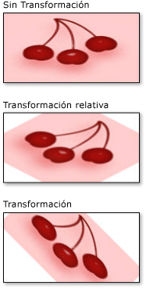

# C&#243;mo: Transformar un pincel
En este ejemplo se muestra cómo transformar objetos <xref:System.Windows.Media.Brush> utilizando sus dos propiedades de transformación: <xref:System.Windows.Media.Brush.RelativeTransform%2A> y <xref:System.Windows.Media.Brush.Transform%2A>.  
  
 En los ejemplos siguientes se utiliza un objeto <xref:System.Windows.Media.RotateTransform> para girar el contenido de un objeto <xref:System.Windows.Media.ImageBrush> 45 grados.  
  
 En la ilustración siguiente se muestra el objeto <xref:System.Windows.Media.ImageBrush> sin <xref:System.Windows.Media.RotateTransform>, con el objeto <xref:System.Windows.Media.RotateTransform> aplicado a la propiedad <xref:System.Windows.Media.Brush.RelativeTransform%2A> y con el objeto <xref:System.Windows.Media.RotateTransform> aplicado a la propiedad <xref:System.Windows.Media.Brush.Transform%2A>.  
  
   
  
## Ejemplo  
 En el primer ejemplo se aplica un objeto <xref:System.Windows.Media.RotateTransform> a la propiedad <xref:System.Windows.Media.Brush.RelativeTransform%2A> de un objeto <xref:System.Windows.Media.ImageBrush>.  Las propiedades <xref:System.Windows.Media.RotateTransform.CenterX%2A> y <xref:System.Windows.Media.RotateTransform.CenterY%2A> de un objeto <xref:System.Windows.Media.RotateTransform> se establecen ambas en 0,5, que es la coordenada relativa del punto central de este contenido.  Como resultado, el contenido del objeto <xref:System.Windows.Media.ImageBrush> gira sobre su centro.  
  
 [!code-csharp[BrushesIntroduction_snip#ImageBrushRelativeTransformExample](../../../../samples/snippets/csharp/VS_Snippets_Wpf/BrushesIntroduction_snip/CSharp/BrushTransformExample.cs#imagebrushrelativetransformexample)]
 [!code-vb[BrushesIntroduction_snip#ImageBrushRelativeTransformExample](../../../../samples/snippets/visualbasic/VS_Snippets_Wpf/BrushesIntroduction_snip/visualbasic/brushtransformexample.vb#imagebrushrelativetransformexample)]
 [!code-xml[BrushesIntroduction_snip#ImageBrushRelativeTransformExample](../../../../samples/snippets/xaml/VS_Snippets_Wpf/BrushesIntroduction_snip/XAML/BrushTransformExample.xaml#imagebrushrelativetransformexample)]  
  
 En el segundo ejemplo también se aplica un objeto <xref:System.Windows.Media.RotateTransform> a <xref:System.Windows.Media.ImageBrush>; sin embargo, en este ejemplo se utiliza la propiedad <xref:System.Windows.Media.Brush.Transform%2A> en lugar de la propiedad <xref:System.Windows.Media.Brush.RelativeTransform%2A>.  
  
 Para girar el pincel sobre su centro, el ejemplo establece las propiedades <xref:System.Windows.Media.RotateTransform.CenterX%2A> y <xref:System.Windows.Media.RotateTransform.CenterY%2A> del objeto <xref:System.Windows.Media.RotateTransform> en coordenadas absolutas.  Dado que el pincel pinta un rectángulo que es de 175 por 90 [píxeles](GTMT), el punto central del rectángulo es \(87,5, 45\).  
  
 [!code-csharp[BrushesIntroduction_snip#ImageBrushTransformExample](../../../../samples/snippets/csharp/VS_Snippets_Wpf/BrushesIntroduction_snip/CSharp/BrushTransformExample.cs#imagebrushtransformexample)]
 [!code-vb[BrushesIntroduction_snip#ImageBrushTransformExample](../../../../samples/snippets/visualbasic/VS_Snippets_Wpf/BrushesIntroduction_snip/visualbasic/brushtransformexample.vb#imagebrushtransformexample)]
 [!code-xml[BrushesIntroduction_snip#ImageBrushTransformExample](../../../../samples/snippets/xaml/VS_Snippets_Wpf/BrushesIntroduction_snip/XAML/BrushTransformExample.xaml#imagebrushtransformexample)]  
  
 Para ver una descripción de cómo funcionan las propiedades <xref:System.Windows.Media.Brush.RelativeTransform%2A> y <xref:System.Windows.Media.Brush.Transform%2A>, vea [Información general sobre la transformación de pinceles](../../../../docs/framework/wpf/graphics-multimedia/brush-transformation-overview.md).  
  
 Para obtener el ejemplo completo, vea [Brushes Sample](http://go.microsoft.com/fwlink/?LinkID=159973).  Para obtener más información acerca de los pinceles, consulte [Información general sobre el dibujo con colores sólidos y degradados](../../../../docs/framework/wpf/graphics-multimedia/painting-with-solid-colors-and-gradients-overview.md).  
  
## Vea también  
 [Información general sobre la transformación de pinceles](../../../../docs/framework/wpf/graphics-multimedia/brush-transformation-overview.md)   
 [Información general sobre el dibujo con colores sólidos y degradados](../../../../docs/framework/wpf/graphics-multimedia/painting-with-solid-colors-and-gradients-overview.md)   
 [Información general sobre transformaciones](../../../../docs/framework/wpf/graphics-multimedia/transforms-overview.md)