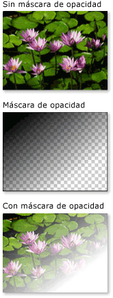
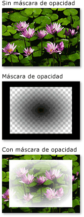

# Informaci&#243;n general sobre las m&#225;scaras de opacidad
Las máscaras de opacidad permiten hacer que partes de un elemento o un objeto visual sean transparentes total o parcialmente.  Para crear una máscara de opacidad, se aplica un <xref:System.Windows.Media.Brush> a la propiedad <xref:System.Windows.UIElement.OpacityMask%2A> de un elemento o <xref:System.Windows.Media.Visual>.  El pincel se asigna al elemento o al objeto visual y el valor de opacidad de cada píxel del pincel se utiliza para determinar la opacidad resultante de cada píxel correspondiente del elemento u objeto visual.  
  
 Este tema contiene las secciones siguientes.  
  
   
-   [Requisitos previos](#prereqs)  
  
-   [Crear efectos visuales con máscaras de opacidad](#opacitymasks)  
  
-   [Crear una máscara de opacidad](#creatingopacitymasks)  
  
-   [Utilizar un degradado como máscara de opacidad](#creatingopacitymaskswithgradients)  
  
-   [Especificar puntos de degradado para una máscara de opacidad](#specifyinggradientcolors)  
  
-   [Utilizar una imagen como máscara de opacidad](#usingimageasopacitymask)  
  
-   [Crear una máscara de opacidad a partir de un dibujo](#drawingbrushasopacitymask)  
  
-   [Temas relacionados](#seeAlsoToggle)  
  
   
## Requisitos previos  
 En esta información general se supone que está familiarizado con los objetos <xref:System.Windows.Media.Brush>.  Para obtener una introducción al uso de pinceles, consulte [Información general sobre el dibujo con colores sólidos y degradados](../../../../docs/framework/wpf/graphics-multimedia/painting-with-solid-colors-and-gradients-overview.md).  Para obtener información acerca de <xref:System.Windows.Media.ImageBrush> y <xref:System.Windows.Media.DrawingBrush>, consulte [Pintar con imágenes, dibujos y elementos visuales](../../../../docs/framework/wpf/graphics-multimedia/painting-with-images-drawings-and-visuals.md).  
  
   
## Crear efectos visuales con máscaras de opacidad  
 Una máscara de opacidad funciona asignando su contenido al elemento u objeto visual.  A continuación, se utiliza el [canal alfa](GTMT) de cada uno de los píxeles del pincel para determinar la opacidad resultante de los píxeles correspondientes del elemento o el objeto visual; se omite el color real del pincel.  Si una parte determinada del pincel es transparente, la parte correspondiente del elemento u objeto visual se vuelve transparente.  Si una parte determinada del pincel es opaca, la opacidad de la parte correspondiente del elemento u objeto visual no cambia.  La opacidad especificada por la máscara de opacidad se combina con cualquier valor de opacidad presente en el elemento u objeto visual.  Por ejemplo, si un elemento es opaco en un 25% y se le aplica una máscara de opacidad que realiza la transición de totalmente opaco a totalmente transparente, el resultado es un elemento que efectúa una transición desde el 25% de opacidad a totalmente transparente.  
  
> [!NOTE]
>  Aunque en los ejemplos de esta información general se muestra el uso de máscaras de opacidad en elementos de imagen, una máscara de opacidad se puede aplicar a cualquier elemento u objeto <xref:System.Windows.Media.Visual>, incluso a los paneles y controles.  
  
 Las máscaras de opacidad se utilizan para crear efectos visuales interesantes, como crear imágenes o botones que se desvanecen mediante un fundido, agregar texturas a los elementos, o combinar degradados para generar superficies cristalinas.  En la ilustración siguiente se muestra el uso de una máscara de opacidad.  Se utiliza un fondo de cuadros para mostrar las partes transparentes de la máscara.  
  
   
Ejemplo de máscara de opacidad  
  
   
## Crear una máscara de opacidad  
 Para crear una máscara de opacidad, se crea un <xref:System.Windows.Media.Brush> y se aplica a la propiedad <xref:System.Windows.UIElement.OpacityMask%2A> de un elemento u objeto visual.  Puede utilizar cualquier tipo de <xref:System.Windows.Media.Brush> como máscara de opacidad.  
  
-   <xref:System.Windows.Media.LinearGradientBrush>, <xref:System.Windows.Media.RadialGradientBrush>: se utiliza para que un elemento o un objeto visual se desvanezcan mediante un fundido.  
  
     En la ilustración siguiente se muestra <xref:System.Windows.Media.LinearGradientBrush> utilizado como máscara de opacidad.  
  
       
Ejemplo de máscara de opacidad con LinearGradientBrush  
  
-   <xref:System.Windows.Media.ImageBrush>: se utiliza para crear textura y efectos de bordes suaves o rasgados.  
  
     En la ilustración siguiente se muestra <xref:System.Windows.Media.ImageBrush> utilizado como máscara de opacidad.  
  
       
Ejemplo de máscara de opacidad con LinearGradientBrush  
  
-   <xref:System.Windows.Media.DrawingBrush>: se utiliza para crear máscaras de opacidad complejas a partir de modelos de formas, imágenes y degradados.  
  
     En la ilustración siguiente se muestra <xref:System.Windows.Media.DrawingBrush> utilizado como máscara de opacidad.  
  
       
Ejemplo de máscara de opacidad con DrawingBrush  
  
 Los pinceles de degradado \(<xref:System.Windows.Media.LinearGradientBrush> y <xref:System.Windows.Media.RadialGradientBrush>\) resultan particularmente apropiados para su uso como máscaras de opacidad.  Dado que <xref:System.Windows.Media.SolidColorBrush> rellena una área de un color uniforme, no es muy eficaz como máscara de opacidad; utilizar <xref:System.Windows.Media.SolidColorBrush> equivale a establecer la propiedad <xref:System.Windows.UIElement.OpacityMask%2A> del elemento u objeto visual.  
  
   
## Utilizar un degradado como máscara de opacidad  
 Para crear un relleno de degradado, se especifican dos o más puntos de degradado.  Cada punto de degradado contiene un color y una posición \(consulte [Información general sobre el dibujo con colores sólidos y degradados](../../../../docs/framework/wpf/graphics-multimedia/painting-with-solid-colors-and-gradients-overview.md) para obtener más información sobre la creación y el uso de degradados\).  El proceso es el mismo cuando se utiliza un degradado como máscara de opacidad, con la excepción de que, en lugar de mezclar los colores, el degradado de la máscara de opacidad mezcla los valores de canal alfa.  En consecuencia, el color real del contenido del degradado no es relevante; únicamente se tiene en cuenta el canal alfa, u opacidad, de cada color.  A continuación, se muestra un ejemplo.  
  
 <!-- TODO: review snippet reference [!code-xml[OpacityMasksExample#LinearGradientOpacityMaskonImage](../../../../samples/snippets/csharp/VS_Snippets_Wpf/OpacityMasksExample/CS/GradientBrushExample.xaml#lineargradientopacitymaskonimage)]  -->
 <!-- TODO: review snippet reference [!code-xml[OpacityMasksExample#LinearGradientOpacityMaskonImage](../../../../samples/snippets/xaml/VS_Snippets_Wpf/OpacityMasksExample/XAML/GradientBrushExample.xaml#lineargradientopacitymaskonimage)]  -->  
  
   
## Especificar puntos de degradado para una máscara de opacidad  
 En el ejemplo anterior, el color <xref:System.Windows.Media.Colors.Black%2A> definido por el sistema se utiliza como color de inicio del degradado.  Dado que todos los colores de la clase <xref:System.Windows.Media.Colors>, excepto <xref:System.Windows.Media.Colors.Transparent%2A>, son totalmente opacos, se pueden utilizar para definir de manera sencilla un color de inicio para una máscara de opacidad de degradado.  
  
 Para controlar más los valores alfa al definir una máscara de opacidad, puede especificar el canal alfa de los colores mediante la notación hexadecimal [!INCLUDE[TLA#tla_argb](../../../../includes/tlasharptla-argb-md.md)] en el marcado o mediante el método <xref:System.Windows.Media.Color.FromScRgb%2A?displayProperty=fullName>.  
  
   
### Especificar la opacidad del color en "XAML"  
 En [!INCLUDE[TLA#tla_xaml](../../../../includes/tlasharptla-xaml-md.md)], se usa la notación hexadecimal [!INCLUDE[TLA2#tla_argb](../../../../includes/tla2sharptla-argb-md.md)] para especificar la opacidad de los colores individuales.  La notación hexadecimal [!INCLUDE[TLA2#tla_argb](../../../../includes/tla2sharptla-argb-md.md)] usa la sintaxis siguiente:  
  
 `#`**aa** *rrggbb*  
  
 *aa* en la línea anterior representa un valor hexadecimal de dos dígitos utilizado para especificar la opacidad del color.  *rr*, *gg* y *bb* representan valores hexadecimales de dos dígitos utilizados para especificar, respectivamente, la cantidad de rojo, verde y azul del color.  Cada dígito hexadecimal puede tener un valor comprendido entre 0 y 9 o entre A y F.  0 es el valor mínimo y F, el máximo.  Un valor alfa de 00 especifica un color completamente transparente, mientras que un valor alfa de FF crea un color totalmente opaco.  En el ejemplo siguiente, se utiliza la notación hexadecimal [!INCLUDE[TLA2#tla_argb](../../../../includes/tla2sharptla-argb-md.md)] para especificar dos colores.  El primero es totalmente opaco, mientras el segundo es completamente transparente.  
  
 <!-- TODO: review snippet reference [!code-xml[OpacityMasksExample#AARRGGBBValueonOpacityMask](../../../../samples/snippets/csharp/VS_Snippets_Wpf/OpacityMasksExample/CS/GradientBrushExample.xaml#aarrggbbvalueonopacitymask)]  -->
 <!-- TODO: review snippet reference [!code-xml[OpacityMasksExample#AARRGGBBValueonOpacityMask](../../../../samples/snippets/xaml/VS_Snippets_Wpf/OpacityMasksExample/XAML/GradientBrushExample.xaml#aarrggbbvalueonopacitymask)]  -->  
  
   
## Utilizar una imagen como máscara de opacidad  
 Las imágenes también se pueden utilizar como máscaras de opacidad.  En la ilustración siguiente se muestra un ejemplo.  Se utiliza un fondo de cuadros para mostrar las partes transparentes de la máscara.  
  
   
Ejemplo de máscara de opacidad  
  
 Para utilizar una imagen como una máscara de opacidad, utilice <xref:System.Windows.Media.ImageBrush> para contener la imagen.  Al crear una imagen que se va a utilizar como máscara de opacidad, guarde la imagen en un formato que admita varios niveles de transparencia, como [!INCLUDE[TLA#tla_png](../../../../includes/tlasharptla-png-md.md)].  En el ejemplo siguiente se muestra el código utilizado para crear la ilustración anterior.  
  
 <!-- TODO: review snippet reference [!code-xml[OpacityMasksExample#UIElementOpacityMask](../../../../samples/snippets/csharp/VS_Snippets_Wpf/OpacityMasksExample/CS/ImageBrushExample.xaml#uielementopacitymask)]  -->
 <!-- TODO: review snippet reference [!code-xml[OpacityMasksExample#UIElementOpacityMask](../../../../samples/snippets/xaml/VS_Snippets_Wpf/OpacityMasksExample/XAML/ImageBrushExample.xaml#uielementopacitymask)]  -->  
  
   
### Utilizar una imagen en mosaico como máscara de opacidad  
 En el ejemplo siguiente, la misma imagen se utiliza con otro <xref:System.Windows.Media.ImageBrush>, pero se utilizan las características de mosaico del pincel para generar mosaicos de la imagen de 50 píxeles cuadrados.  
  
 <!-- TODO: review snippet reference [!code-xml[OpacityMasksExample#TiledImageasOpacityMask](../../../../samples/snippets/csharp/VS_Snippets_Wpf/OpacityMasksExample/CS/ImageBrushExample.xaml#tiledimageasopacitymask)]  -->
 <!-- TODO: review snippet reference [!code-xml[OpacityMasksExample#TiledImageasOpacityMask](../../../../samples/snippets/xaml/VS_Snippets_Wpf/OpacityMasksExample/XAML/ImageBrushExample.xaml#tiledimageasopacitymask)]  -->  
  
   
## Crear una máscara de opacidad a partir de un dibujo  
 Se pueden utilizar dibujos como máscaras de opacidad.  Las formas contenidas dentro del dibujo se pueden rellenar con degradados, colores sólidos, imágenes o incluso otros dibujos.  En la ilustración siguiente se muestra un ejemplo de un dibujo utilizado como máscara de opacidad.  Se utiliza un fondo de cuadros para mostrar las partes transparentes de la máscara.  
  
   
Ejemplo de máscara de opacidad con DrawingBrush  
  
 Para utilizar un dibujo como máscara de opacidad, utilice <xref:System.Windows.Media.DrawingBrush> para contener el dibujo.  En el ejemplo siguiente se muestra el código utilizado para crear la ilustración anterior:  
  
 <!-- TODO: review snippet reference [!code-xml[OpacityMasksExample#OpacityMaskfromDrawing](../../../../samples/snippets/csharp/VS_Snippets_Wpf/OpacityMasksExample/CS/DrawingBrushExample.xaml#opacitymaskfromdrawing)]  -->
 <!-- TODO: review snippet reference [!code-xml[OpacityMasksExample#OpacityMaskfromDrawing](../../../../samples/snippets/xaml/VS_Snippets_Wpf/OpacityMasksExample/XAML/DrawingBrushExample.xaml#opacitymaskfromdrawing)]  -->  
  
   
### Utilizar un dibujo en mosaico como máscara de opacidad  
 Al igual que <xref:System.Windows.Media.ImageBrush>, se puede hacer que <xref:System.Windows.Media.DrawingBrush> cree el dibujo en mosaico.  En el ejemplo siguiente, se utiliza un pincel de dibujo para crear una máscara de opacidad en mosaico.  
  
 <!-- TODO: review snippet reference [!code-xml[OpacityMasksExample#TiledDrawingasOpacityMask](../../../../samples/snippets/csharp/VS_Snippets_Wpf/OpacityMasksExample/CS/DrawingBrushExample.xaml#tileddrawingasopacitymask)]  -->
 <!-- TODO: review snippet reference [!code-xml[OpacityMasksExample#TiledDrawingasOpacityMask](../../../../samples/snippets/xaml/VS_Snippets_Wpf/OpacityMasksExample/XAML/DrawingBrushExample.xaml#tileddrawingasopacitymask)]  -->  
  
## Vea también  
 [Pintar con imágenes, dibujos y elementos visuales](../../../../docs/framework/wpf/graphics-multimedia/painting-with-images-drawings-and-visuals.md)   
 [Información general sobre el dibujo con colores sólidos y degradados](../../../../docs/framework/wpf/graphics-multimedia/painting-with-solid-colors-and-gradients-overview.md)