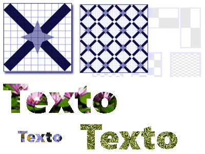
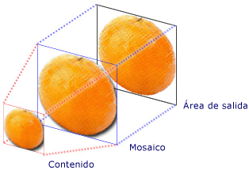

# Pintar con im&#225;genes, dibujos y elementos visuales
En este tema se describe cómo utilizar objetos <xref:System.Windows.Media.ImageBrush>, <xref:System.Windows.Media.DrawingBrush>y <xref:System.Windows.Media.VisualBrush> para pintar una área con una imagen o con un objeto <xref:System.Windows.Media.Drawing> o <xref:System.Windows.Media.Visual>.  
  
 [!INCLUDE[autoOutline](../Token/autoOutline_md.md)]  
  
   
## Requisitos previos  
 Para entender este tema, debe estar familiarizado con los diferentes tipos de pinceles que [!INCLUDE[TLA#tla_winclient](../../../../includes/tlasharptla-winclient-md.md)] proporciona y sus características básicas.  Para obtener una introducción, consulte [Información general sobre pinceles de WPF](../../../../docs/framework/wpf/graphics-multimedia/wpf-brushes-overview.md).  
  
   
## Pintar un área con una imagen  
 Un <xref:System.Windows.Media.ImageBrush> pinta una área con un objeto <xref:System.Windows.Media.ImageSource>.  El tipo más común de <xref:System.Windows.Media.ImageSource> para su uso con <xref:System.Windows.Media.ImageBrush> es <xref:System.Windows.Media.Imaging.BitmapImage>, que describe un gráfico de mapa de bits.  Puede utilizar un objeto <xref:System.Windows.Media.DrawingImage> para pintar mediante un objeto <xref:System.Windows.Media.Drawing>, pero es más fácil utilizar un objeto <xref:System.Windows.Media.DrawingBrush> en su lugar.  Para obtener más información acerca de los objetos <xref:System.Windows.Media.ImageSource>, consulte [Información general sobre imágenes](../../../../docs/framework/wpf/graphics-multimedia/imaging-overview.md).  
  
 Para pintar con <xref:System.Windows.Media.ImageBrush>, cree un objeto <xref:System.Windows.Media.Imaging.BitmapImage> y utilícelo para cargar el contenido del mapa de bits.  A continuación, utilice <xref:System.Windows.Media.Imaging.BitmapImage> para establecer la propiedad <xref:System.Windows.Media.ImageBrush.ImageSource%2A> de <xref:System.Windows.Media.ImageBrush>.  Por último, aplique <xref:System.Windows.Media.ImageBrush> al objeto que desea pintar.  En [!INCLUDE[TLA#tla_xaml](../../../../includes/tlasharptla-xaml-md.md)], también puede establecer simplemente la propiedad <xref:System.Windows.Media.ImageBrush.ImageSource%2A> de <xref:System.Windows.Media.ImageBrush> en la ruta de acceso de la imagen que desea cargar.  
  
 Al igual que todos los objetos <xref:System.Windows.Media.Brush>, <xref:System.Windows.Media.ImageBrush> se puede utilizar para pintar objetos como formas, paneles, controles y texto.  En la ilustración siguiente se muestran algunos efectos que se pueden lograr con <xref:System.Windows.Media.ImageBrush>.  
  
   
Objetos pintados con ImageBrush  
  
 De manera predeterminada, <xref:System.Windows.Media.ImageBrush> expande su imagen a fin de rellenar completamente el área pintada, con lo que es posible que se distorsione la imagen si el área pintada tiene una relación de aspecto diferente que la imagen.  Puede cambiar este comportamiento modificando el valor predeterminado de la propiedad <xref:System.Windows.Media.TileBrush.Stretch%2A>, <xref:System.Windows.Media.Stretch>, por uno de estos valores: <xref:System.Windows.Media.Stretch>, <xref:System.Windows.Media.Stretch> o <xref:System.Windows.Media.Stretch>.  Dado que <xref:System.Windows.Media.ImageBrush> es un tipo de <xref:System.Windows.Media.TileBrush>, puede especificar con exactitud de qué modo el pincel de imagen rellenará el área de salida, e incluso crear tramas.  Para obtener más información sobre características avanzadas de <xref:System.Windows.Media.TileBrush>, consulte [Información general sobre objetos TileBrush](../../../../docs/framework/wpf/graphics-multimedia/tilebrush-overview.md).  
  
   
## Ejemplo: Pintar un objeto con una imagen de mapa de bits  
 En el ejemplo siguiente se usa un objeto <xref:System.Windows.Media.ImageBrush> para pintar la propiedad <xref:System.Windows.Controls.Panel.Background%2A> de un objeto <xref:System.Windows.Controls.Canvas>.  
  
 [!code-xml[BrushOverviewExamples_snip#GraphicsMMImageBrushAsCanvasBackgroundExampleWholePage](../../../../samples/snippets/xaml/VS_Snippets_Wpf/BrushOverviewExamples_snip/XAML/ImageBrushExample.xaml#graphicsmmimagebrushascanvasbackgroundexamplewholepage)]  
  
 [!code-csharp[BrushOverviewExamples_procedural_snip#GraphicsMMImageBrushAsCanvasBackgroundExampleWholePage](../../../../samples/snippets/csharp/VS_Snippets_Wpf/BrushOverviewExamples_procedural_snip/CSharp/ImageBrushExample.cs#graphicsmmimagebrushascanvasbackgroundexamplewholepage)]
 [!code-vb[BrushOverviewExamples_procedural_snip#GraphicsMMImageBrushAsCanvasBackgroundExampleWholePage](../../../../samples/snippets/visualbasic/VS_Snippets_Wpf/BrushOverviewExamples_procedural_snip/visualbasic/imagebrushexample.vb#graphicsmmimagebrushascanvasbackgroundexamplewholepage)]  
  
   
## Pintar un área con un dibujo  
 Un objeto <xref:System.Windows.Media.DrawingBrush> permite pintar una área con formas, texto, imágenes y vídeo.  Las formas contenidas en un pincel de dibujo pueden pintarse a su vez con un color sólido, un degradado, una imagen o incluso un objeto <xref:System.Windows.Media.DrawingBrush>.  En la siguiente ilustración se muestran algunos usos de <xref:System.Windows.Media.DrawingBrush>.  
  
   
Objetos pintados mediante DrawingBrush  
  
 Un objeto <xref:System.Windows.Media.DrawingBrush> pinta un área con un objeto <xref:System.Windows.Media.Drawing>.  Un objeto de dibujo, o <xref:System.Windows.Media.Drawing>, describe el contenido visible, como una forma, un mapa de bits, vídeo o una línea de texto.  Los diferentes tipos de dibujos describen tipos diferentes de contenido.  A continuación, se muestra una lista de tipos diferentes de objetos de dibujo.  
  
-   <xref:System.Windows.Media.GeometryDrawing>: dibuja una forma.  
  
-   <xref:System.Windows.Media.ImageDrawing>: dibuja una imagen.  
  
-   <xref:System.Windows.Media.GlyphRunDrawing>: dibuja texto.  
  
-   <xref:System.Windows.Media.VideoDrawing>: reproduce un archivo de audio o vídeo.  
  
-   <xref:System.Windows.Media.DrawingGroup>: dibuja otros dibujos.  Utilice un grupo de dibujo para combinar otros dibujos en un único dibujo compuesto.  
  
 Para obtener más información acerca de los objetos <xref:System.Windows.Media.Drawing>, vea [Información general sobre objetos Drawing](../../../../docs/framework/wpf/graphics-multimedia/drawing-objects-overview.md).  
  
 Al igual que un objeto <xref:System.Windows.Media.ImageBrush>, un objeto <xref:System.Windows.Media.DrawingBrush> expande su propiedad <xref:System.Windows.Media.DrawingBrush.Drawing%2A> para rellenar su área de salida.  Puede invalidar este comportamiento cambiando el valor predeterminado \(<xref:System.Windows.Media.Stretch>\) de la propiedad <xref:System.Windows.Media.TileBrush.Stretch%2A>.  Para obtener más información, vea la propiedad <xref:System.Windows.Media.TileBrush.Stretch%2A>.  
  
   
## Ejemplo: Pintar un objeto con un dibujo  
 En el ejemplo siguiente se muestra cómo pintar un objeto con un dibujo de tres elipses.  <xref:System.Windows.Media.GeometryDrawing> se utiliza para describir las elipses.  
  
 [!code-xml[BrushOverviewExamples_snip#GraphicsMMDrawingBrushAsButtonBackgroundExample](../../../../samples/snippets/xaml/VS_Snippets_Wpf/BrushOverviewExamples_snip/XAML/DrawingBrushExample.xaml#graphicsmmdrawingbrushasbuttonbackgroundexample)]  
  
 [!code-csharp[BrushOverviewExamples_procedural_snip#GraphicsMMDrawingBrushAsButtonBackgroundExample1](../../../../samples/snippets/csharp/VS_Snippets_Wpf/BrushOverviewExamples_procedural_snip/CSharp/DrawingBrushExample.cs#graphicsmmdrawingbrushasbuttonbackgroundexample1)]
 [!code-vb[BrushOverviewExamples_procedural_snip#GraphicsMMDrawingBrushAsButtonBackgroundExample1](../../../../samples/snippets/visualbasic/VS_Snippets_Wpf/BrushOverviewExamples_procedural_snip/visualbasic/drawingbrushexample.vb#graphicsmmdrawingbrushasbuttonbackgroundexample1)]  
  
   
## Pintar una área con un objeto visual  
 El más versátil y eficaz de todos los pinceles, <xref:System.Windows.Media.VisualBrush>, pinta una área con un objeto <xref:System.Windows.Media.Visual>.  Un objeto <xref:System.Windows.Media.Visual> es un tipo de gráfico de bajo nivel que actúa como antecesor de muchos componentes gráficos útiles.  Por ejemplo, las clases <xref:System.Windows.Window>, <xref:System.Windows.FrameworkElement> y <xref:System.Windows.Controls.Control> son tipos de objetos <xref:System.Windows.Media.Visual>.  Con <xref:System.Windows.Media.VisualBrush>, puede pintar áreas con casi cualquier objeto gráfico de [!INCLUDE[TLA#tla_winclient](../../../../includes/tlasharptla-winclient-md.md)].  
  
> [!NOTE]
>  Aunque <xref:System.Windows.Media.VisualBrush> es un tipo del objeto <xref:System.Windows.Freezable>, no se puede inmovilizar \(establecer como de sólo lectura\) cuando su propiedad <xref:System.Windows.Media.VisualBrush.Visual%2A> está establecida en un valor distinto de `null`.  
  
 Hay dos maneras de especificar el contenido de la propiedad <xref:System.Windows.Media.VisualBrush.Visual%2A> de un objeto <xref:System.Windows.Media.VisualBrush>.  
  
-   Cree un nuevo objeto <xref:System.Windows.Media.Visual> y utilícelo para establecer la propiedad <xref:System.Windows.Media.VisualBrush.Visual%2A> de <xref:System.Windows.Media.VisualBrush>.  Para obtener un ejemplo, consulte la sección [Ejemplo: Pintar un objeto con un objeto visual](#examplevisualbrush1) que figura más adelante.  
  
-   Utilice un objeto <xref:System.Windows.Media.Visual> existente, que crea una imagen duplicada del objeto <xref:System.Windows.Media.Visual> de destino.  A continuación, puede utilizar <xref:System.Windows.Media.VisualBrush> para crear efectos interesantes, tales como reflexiones y ampliaciones.  Para obtener un ejemplo, consulte la sección [Ejemplo: Crear una reflexión](#examplevisualbrush2).  
  
 Cuando se define un nuevo objeto <xref:System.Windows.Media.VisualBrush.Visual%2A> para <xref:System.Windows.Media.VisualBrush> y ese objeto <xref:System.Windows.Media.Visual> es un elemento <xref:System.Windows.UIElement> \(por ejemplo, un panel o un control\), el sistema del diseño se ejecuta en el <xref:System.Windows.UIElement> y sus elementos secundarios cuando la propiedad <xref:System.Windows.Media.VisualBrush.AutoLayoutContent%2A> está establecida en `true`.  Sin embargo, el <xref:System.Windows.UIElement> raíz queda aislado esencialmente del resto del sistema: los estilos y el diseño externo no puede penetrar este límite.  Por consiguiente, debe especificar explícitamente el tamaño del elemento <xref:System.Windows.UIElement> raíz, porque su único elemento primario es <xref:System.Windows.Media.VisualBrush> y, por consiguiente, su tamaño no se puede ajustar automáticamente al área pintada.  Para obtener más información acerca del diseño en [!INCLUDE[TLA#tla_winclient](../../../../includes/tlasharptla-winclient-md.md)], consulte [Diseño](../../../../docs/framework/wpf/advanced/layout.md).  
  
 Al igual que <xref:System.Windows.Media.ImageBrush> y <xref:System.Windows.Media.DrawingBrush>, un objeto <xref:System.Windows.Media.VisualBrush> expande su contenido a fin de rellenar su área de salida.  Puede invalidar este comportamiento cambiando el valor predeterminado \(<xref:System.Windows.Media.Stretch>\) de la propiedad <xref:System.Windows.Media.TileBrush.Stretch%2A>.  Para obtener más información, vea la propiedad <xref:System.Windows.Media.TileBrush.Stretch%2A>.  
  
   
## Ejemplo: Pintar un objeto con un objeto visual  
 En el ejemplo siguiente, se utilizan varios controles y un panel para pintar un rectángulo.  
  
 [!code-xml[BrushOverviewExamples_snip#GraphicsMMVisualBrushAsRectangleBackgroundExample](../../../../samples/snippets/xaml/VS_Snippets_Wpf/BrushOverviewExamples_snip/XAML/VisualBrushExample.xaml#graphicsmmvisualbrushasrectanglebackgroundexample)]  
  
 [!code-csharp[BrushOverviewExamples_procedural_snip#GraphicsMMVisualBrushAsRectangleBackgroundExample1](../../../../samples/snippets/csharp/VS_Snippets_Wpf/BrushOverviewExamples_procedural_snip/CSharp/VisualBrushExample.cs#graphicsmmvisualbrushasrectanglebackgroundexample1)]
 [!code-vb[BrushOverviewExamples_procedural_snip#GraphicsMMVisualBrushAsRectangleBackgroundExample1](../../../../samples/snippets/visualbasic/VS_Snippets_Wpf/BrushOverviewExamples_procedural_snip/visualbasic/visualbrushexample.vb#graphicsmmvisualbrushasrectanglebackgroundexample1)]  
  
   
## Ejemplo: Crear una reflexión  
 En el ejemplo anterior se ha mostrado cómo crear un nuevo objeto <xref:System.Windows.Media.Visual> para su uso como fondo.  También puede utilizar un objeto <xref:System.Windows.Media.VisualBrush> para mostrar un objeto visual existente; esta función permite producir efectos visuales interesantes, tales como reflexiones y ampliaciones.  En el ejemplo siguiente se usa <xref:System.Windows.Media.VisualBrush> para crear una reflexión de un <xref:System.Windows.Controls.Border> que contiene varios elementos.  En la ilustración siguiente se muestra el resultado de aplicar este ejemplo.  
  
   
Objeto visual reflejado  
  
 [!code-csharp[visualbrush_markup_snip#GraphicsMMVisualBrushReflectionExampleWholePage](../../../../samples/snippets/csharp/VS_Snippets_Wpf/visualbrush_markup_snip/CSharp/ReflectionExample.cs#graphicsmmvisualbrushreflectionexamplewholepage)]
 [!code-vb[visualbrush_markup_snip#GraphicsMMVisualBrushReflectionExampleWholePage](../../../../samples/snippets/visualbasic/VS_Snippets_Wpf/visualbrush_markup_snip/visualbasic/reflectionexample.vb#graphicsmmvisualbrushreflectionexamplewholepage)]
 [!code-xml[visualbrush_markup_snip#GraphicsMMVisualBrushReflectionExampleWholePage](../../../../samples/snippets/xaml/VS_Snippets_Wpf/visualbrush_markup_snip/XAML/ReflectionExample.xaml#graphicsmmvisualbrushreflectionexamplewholepage)]  
  
 Para obtener ejemplos adicionales que muestran cómo ampliar partes de la pantalla y cómo crear reflexiones, vea [VisualBrush Sample](http://go.microsoft.com/fwlink/?LinkID=160049).  
  
   
## Características de TileBrush  
 <xref:System.Windows.Media.ImageBrush>, <xref:System.Windows.Media.DrawingBrush> y <xref:System.Windows.Media.VisualBrush> son tipos de objetos <xref:System.Windows.Media.TileBrush>.  Los objetos <xref:System.Windows.Media.TileBrush> proporcionan un gran control sobre cómo se pinta un área con una imagen, un dibujo o un objeto visual.  Por ejemplo, en lugar de limitarse a pintar una área con una sola imagen ajustada, puede hacerlo con una serie de mosaicos de la imagen que crean una trama.  
  
 <xref:System.Windows.Media.TileBrush> tiene tres componentes primarios: el contenido, los mosaicos y el área de salida.  
  
   
Componentes de TileBrush con un solo mosaico  
  
   
Componentes de TileBrush con varios mosaicos  
  
 Para obtener más información sobre las características de mosaico de los objetos <xref:System.Windows.Media.TileBrush>, consulte [Información general sobre objetos TileBrush](../../../../docs/framework/wpf/graphics-multimedia/tilebrush-overview.md).  
  
## Vea también  
 <xref:System.Windows.Media.ImageBrush>   
 <xref:System.Windows.Media.DrawingBrush>   
 <xref:System.Windows.Media.VisualBrush>   
 <xref:System.Windows.Media.TileBrush>   
 [Información general sobre objetos TileBrush](../../../../docs/framework/wpf/graphics-multimedia/tilebrush-overview.md)   
 [Información general sobre pinceles de WPF](../../../../docs/framework/wpf/graphics-multimedia/wpf-brushes-overview.md)   
 [Información general sobre imágenes](../../../../docs/framework/wpf/graphics-multimedia/imaging-overview.md)   
 [Información general sobre objetos Drawing](../../../../docs/framework/wpf/graphics-multimedia/drawing-objects-overview.md)   
 [Información general sobre las máscaras de opacidad](../../../../docs/framework/wpf/graphics-multimedia/opacity-masks-overview.md)   
 [Información general sobre la representación de gráficos en WPF](../../../../docs/framework/wpf/graphics-multimedia/wpf-graphics-rendering-overview.md)   
 [Ejemplo ImageBrush](http://go.microsoft.com/fwlink/?LinkID=160005)   
 [Ejemplo VisualBrush](http://go.microsoft.com/fwlink/?LinkID=160049)