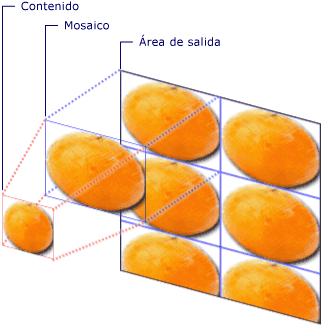
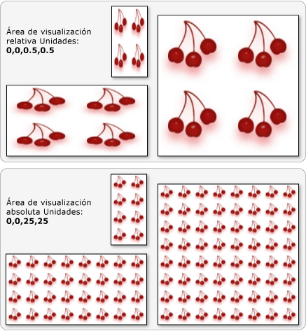

# Informaci&#243;n general sobre objetos TileBrush
Los objetos <xref:System.Windows.Media.TileBrush> proporcionan un gran control sobre cómo se pinta un área con una imagen, o con un objeto <xref:System.Windows.Media.Drawing> o <xref:System.Windows.Media.Visual>.  En este tema se describe cómo utilizar las características de <xref:System.Windows.Media.TileBrush> para obtener un mayor control sobre cómo se pinta un área con <xref:System.Windows.Media.ImageBrush>, <xref:System.Windows.Media.DrawingBrush> o <xref:System.Windows.Media.VisualBrush>.  
  
   
  
   
## Requisitos previos  
 Para entender este tema, resulta útil comprender cómo utilizar las características básicas de las clases <xref:System.Windows.Media.ImageBrush>, <xref:System.Windows.Media.DrawingBrush> y <xref:System.Windows.Media.VisualBrush>.  Para ver una introducción a estos tipos, consulte [Pintar con imágenes, dibujos y elementos visuales](../../../../docs/framework/wpf/graphics-multimedia/painting-with-images-drawings-and-visuals.md).  
  
   
## Pintar un área con mosaicos  
 <xref:System.Windows.Media.ImageBrush>, <xref:System.Windows.Media.DrawingBrush> y <xref:System.Windows.Media.VisualBrush> son tipos de objetos <xref:System.Windows.Media.TileBrush>.  Los pinceles de mosaico le proporcionan un gran control sobre cómo se pinta un área con una imagen, un dibujo o un objeto visual.  Por ejemplo, en lugar de limitarse a pintar una área con una sola imagen ajustada, puede hacerlo con una serie de mosaicos de la imagen que crean una trama.  
  
 Al pintar un área con un pincel de mosaico se utilizan tres componentes: el contenido, el mosaico base y el área de salida.  
  
   
Componentes de TileBrush con un solo mosaico  
  
   
Componentes de TileBrush con Tile como TileMode  
  
 El área de salida es el área que se pinta, como la propiedad <xref:System.Windows.Shapes.Shape.Fill%2A> de un objeto <xref:System.Windows.Shapes.Ellipse> o la propiedad <xref:System.Windows.Controls.Control.Background%2A> de un objeto <xref:System.Windows.Controls.Button>.  En las secciones siguientes se describen los otros dos componentes de <xref:System.Windows.Media.TileBrush>.  
  
   
## Contenido del pincel  
 Hay tres tipos diferentes de <xref:System.Windows.Media.TileBrush> y cada uno de ellos pinta con un tipo diferente de contenido.  
  
-   Si el pincel es <xref:System.Windows.Media.ImageBrush>, este contenido es una imagen. La propiedad <xref:System.Windows.Media.ImageBrush.ImageSource%2A> especifica el contenido de <xref:System.Windows.Media.ImageBrush>.  
  
-   Si el pincel es <xref:System.Windows.Media.DrawingBrush>, este contenido es un dibujo.  La propiedad <xref:System.Windows.Media.DrawingBrush.Drawing%2A> especifica el contenido de <xref:System.Windows.Media.DrawingBrush>.  
  
-   Si el pincel es <xref:System.Windows.Media.VisualBrush>, este contenido es un objeto visual.  La propiedad <xref:System.Windows.Media.VisualBrush.Visual%2A> especifica el contenido de <xref:System.Windows.Media.VisualBrush>.  
  
 Puede especificar la posición y las dimensiones del contenido de <xref:System.Windows.Media.TileBrush> mediante la propiedad <xref:System.Windows.Media.TileBrush.Viewbox%2A>, aunque es frecuente dejar la propiedad <xref:System.Windows.Media.TileBrush.Viewbox%2A> establecida en su valor predeterminado.  De manera predeterminada, <xref:System.Windows.Media.TileBrush.Viewbox%2A> se configura para contener completamente el contenido del pincel.  Para obtener más información sobre cómo configurar <xref:System.Windows.Controls.Viewbox>, consulte la página de propiedades de <xref:System.Windows.Controls.Viewbox>.  
  
   
## Mosaico base  
 Un objeto <xref:System.Windows.Media.TileBrush> proyecta su contenido en un mosaico base.  La propiedad <xref:System.Windows.Media.TileBrush.Stretch%2A> controla cómo se ajusta el contenido de <xref:System.Windows.Media.TileBrush> para rellenar el mosaico base.  La propiedad <xref:System.Windows.Media.TileBrush.Stretch%2A> acepta los valores siguientes, definidos por la enumeración <xref:System.Windows.Media.Stretch>:  
  
-   <xref:System.Windows.Media.Stretch>: el contenido del pincel no se ajusta para rellenar el mosaico.  
  
-   <xref:System.Windows.Media.Stretch>: se ajusta la escala del contenido del pincel para ajustarla al mosaico.  Dado que la escala del alto y del ancho del contenido se ajusta de manera independiente, puede que no se conserve la relación de aspecto original del contenido.  Es decir, puede que el contenido del pincel quede distorsionado al rellenar completamente el mosaico de salida.  
  
-   <xref:System.Windows.Media.Stretch>: se ajusta la escala del contenido del pincel para que se ajuste completamente dentro del mosaico.  Se conserva la relación de aspecto del contenido.  
  
-   <xref:System.Windows.Media.Stretch>: se ajusta la escala del contenido del pincel para que rellene completamente el área de salida conservando la relación de aspecto original del contenido.  
  
 En la siguiente imagen se ilustran los diferentes valores de <xref:System.Windows.Media.TileBrush.Stretch%2A>.  
  
   
  
 En el ejemplo siguiente, se establece el contenido de un objeto <xref:System.Windows.Media.ImageBrush> de modo que no se ajusta para rellenar el área de salida.  
  
 [!code-xml[BrushOverviewExamples_snip#GraphicsMMNoStretchExample](../../../../samples/snippets/xaml/VS_Snippets_Wpf/BrushOverviewExamples_snip/XAML/StretchExample.xaml#graphicsmmnostretchexample)]  
  
 [!code-csharp[BrushOverviewExamples_procedural_snip#GraphicsMMNoStretchExample](../../../../samples/snippets/csharp/VS_Snippets_Wpf/BrushOverviewExamples_procedural_snip/CSharp/StretchExample.cs#graphicsmmnostretchexample)]
 [!code-vb[BrushOverviewExamples_procedural_snip#GraphicsMMNoStretchExample](../../../../samples/snippets/visualbasic/VS_Snippets_Wpf/BrushOverviewExamples_procedural_snip/visualbasic/stretchexample.vb#graphicsmmnostretchexample)]  
  
 De manera predeterminada, <xref:System.Windows.Media.TileBrush> genera un mosaico único \(el mosaico base\) y ajusta ese mosaico hasta rellenar completamente el área de salida.  Puede cambiar el tamaño y la posición del mosaico base estableciendo las propiedades <xref:System.Windows.Media.TileBrush.Viewport%2A> y <xref:System.Windows.Media.TileBrush.ViewportUnits%2A>.  
  
   
### Tamaño del mosaico base  
 La propiedad <xref:System.Windows.Media.TileBrush.Viewport%2A> determina el tamaño y la posición del mosaico base; la propiedad <xref:System.Windows.Media.TileBrush.ViewportUnits%2A> determina si <xref:System.Windows.Media.TileBrush.Viewport%2A> se especifica mediante coordenadas absolutas o relativas.  Si las coordenadas son relativas, son relativas al tamaño del área de salida.  El punto \(0,0\) representa la esquina superior izquierda del área de salida y \(1,1\) representa la esquina inferior derecha del área de salida.  Para especificar que la propiedad <xref:System.Windows.Media.TileBrush.Viewport%2A> utiliza coordenadas absolutas, establezca la propiedad <xref:System.Windows.Media.TileBrush.ViewportUnits%2A> en <xref:System.Windows.Media.BrushMappingMode>.  
  
 En la ilustración siguiente se muestra la diferencia entre una propiedad <xref:System.Windows.Media.TileBrush.ViewportUnits%2A> absoluta y relativa para <xref:System.Windows.Media.TileBrush>.  Observe que ambas ilustraciones muestran una trama de mosaico; en la sección siguiente se describe cómo especificar una trama de mosaico.  
  
   
  
 En el ejemplo siguiente, se utiliza una imagen para crear un mosaico con un ancho y un alto del 50%.  El mosaico base se sitúa en \(0,0\) en el área de salida.  
  
 [!code-xml[BrushOverviewExamples_snip#GraphicsMMRelativeViewportUnitsExample1](../../../../samples/snippets/xaml/VS_Snippets_Wpf/BrushOverviewExamples_snip/XAML/TileSizeExample.xaml#graphicsmmrelativeviewportunitsexample1)]  
  
 [!code-csharp[BrushOverviewExamples_procedural_snip#GraphicsMMRelativeViewportUnitsExample1](../../../../samples/snippets/csharp/VS_Snippets_Wpf/BrushOverviewExamples_procedural_snip/CSharp/TileSizeExample.cs#graphicsmmrelativeviewportunitsexample1)]
 [!code-vb[BrushOverviewExamples_procedural_snip#GraphicsMMRelativeViewportUnitsExample1](../../../../samples/snippets/visualbasic/VS_Snippets_Wpf/BrushOverviewExamples_procedural_snip/visualbasic/tilesizeexample.vb#graphicsmmrelativeviewportunitsexample1)]  
  
 En el ejemplo siguiente se establecen los mosaicos de <xref:System.Windows.Media.ImageBrush> en un tamaño de 25 por 25 [píxeles independientes del dispositivo](GTMT).  Dado que el valor de <xref:System.Windows.Media.TileBrush.ViewportUnits%2A> es absoluto, los mosaicos de <xref:System.Windows.Media.ImageBrush> siempre tienen 25 por 25 píxeles, independientemente del área pintada.  
  
 [!code-xml[BrushOverviewExamples_snip#GraphicsMMAbsoluteViewportUnitsExample1](../../../../samples/snippets/xaml/VS_Snippets_Wpf/BrushOverviewExamples_snip/XAML/TileSizeExample.xaml#graphicsmmabsoluteviewportunitsexample1)]  
  
 [!code-csharp[BrushOverviewExamples_procedural_snip#GraphicsMMAbsoluteViewportUnitsExample1](../../../../samples/snippets/csharp/VS_Snippets_Wpf/BrushOverviewExamples_procedural_snip/CSharp/TileSizeExample.cs#graphicsmmabsoluteviewportunitsexample1)]
 [!code-vb[BrushOverviewExamples_procedural_snip#GraphicsMMAbsoluteViewportUnitsExample1](../../../../samples/snippets/visualbasic/VS_Snippets_Wpf/BrushOverviewExamples_procedural_snip/visualbasic/tilesizeexample.vb#graphicsmmabsoluteviewportunitsexample1)]  
  
   
### Comportamiento de mosaico  
 <xref:System.Windows.Media.TileBrush> genera una trama de mosaico cuando su mosaico base no rellena completamente el área de salida y se especifica un modo de mosaico distinto de <xref:System.Windows.Media.TileMode>.  Cuando el mosaico de un pincel de mosaico no rellena completamente el área de salida, su propiedad <xref:System.Windows.Media.TileBrush.TileMode%2A> especifica si el mosaico base se debe duplicar para rellenar el área de salida y, en caso afirmativo, cómo se debe duplicar.  La propiedad <xref:System.Windows.Media.TileBrush.TileMode%2A> acepta los valores siguientes, definidos por la enumeración <xref:System.Windows.Media.TileMode>:  
  
-   <xref:System.Windows.Media.TileMode>: sólo se dibuja el mosaico base.  
  
-   <xref:System.Windows.Media.TileMode>: se dibuja el mosaico base y el área restante se rellena repitiendo el mosaico base de tal modo que el borde derecho de un mosaico sea adyacente al borde izquierdo del siguiente, y lo mismo en sentido vertical.  
  
-   <xref:System.Windows.Media.TileMode>: igual que <xref:System.Windows.Media.TileMode>, pero volteando en sentido horizontal columnas alternas de mosaicos.  
  
-   <xref:System.Windows.Media.TileMode>: igual que <xref:System.Windows.Media.TileMode>, pero volteando en sentido vertical filas alternas de mosaicos.  
  
-   <xref:System.Windows.Media.TileMode>: combinación de <xref:System.Windows.Media.TileMode> y <xref:System.Windows.Media.TileMode>.  
  
 En la siguiente imagen se ilustran los diferentes modos de mosaico.  
  
   
  
 En el ejemplo siguiente, se utiliza una imagen para pintar un rectángulo de 100 píxeles de ancho por 100 píxeles de alto.  La propiedad <xref:System.Windows.Media.TileBrush.Viewport%2A> del pincel se ha establecido en 0,0,0.25,0.25; el mosaico base del pincel ocupa 1\/4 del área de salida.  La propiedad <xref:System.Windows.Media.TileBrush.TileMode%2A> del pincel se establece en <xref:System.Windows.Media.TileMode>,  para que rellene el rectángulo con filas de mosaicos.  
  
 [!code-xml[BrushOverviewExamples_snip#GraphicsMMFlipXYExample](../../../../samples/snippets/xaml/VS_Snippets_Wpf/BrushOverviewExamples_snip/XAML/TilingExample.xaml#graphicsmmflipxyexample)]  
  
 [!code-csharp[BrushOverviewExamples_procedural_snip#GraphicsMMFlipXYExample](../../../../samples/snippets/csharp/VS_Snippets_Wpf/BrushOverviewExamples_procedural_snip/CSharp/TilingExample.cs#graphicsmmflipxyexample)]
 [!code-vb[BrushOverviewExamples_procedural_snip#GraphicsMMFlipXYExample](../../../../samples/snippets/visualbasic/VS_Snippets_Wpf/BrushOverviewExamples_procedural_snip/visualbasic/tilingexample.vb#graphicsmmflipxyexample)]  
  
## Vea también  
 <xref:System.Windows.Media.ImageBrush>   
 <xref:System.Windows.Media.DrawingBrush>   
 <xref:System.Windows.Media.VisualBrush>   
 <xref:System.Windows.Media.TileBrush>   
 [Pintar con imágenes, dibujos y elementos visuales](../../../../docs/framework/wpf/graphics-multimedia/painting-with-images-drawings-and-visuals.md)   
 [Temas "Cómo..."](../../../../docs/framework/wpf/graphics-multimedia/brushes-how-to-topics.md)   
 [Información general sobre objetos Freezable](../../../../docs/framework/wpf/advanced/freezable-objects-overview.md)   
 [Ejemplo ImageBrush](http://go.microsoft.com/fwlink/?LinkID=160005)   
 [Ejemplo VisualBrush](http://go.microsoft.com/fwlink/?LinkID=160049)