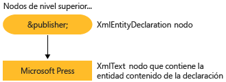

# <a name="reading-entity-declarations-and-entity-references-into-the-dom"></a>Leer declaraciones de entidad y referencias de entidad en DOM
Una entidad es una declaración que establece un nombre que se va a utilizar en el código XML en lugar de contenido o marcado. Para las entidades hay dos partes. En primer lugar, se debe asociar un nombre al contenido de reemplazo, utilizando una declaración de entidad. Una declaración de entidad se crea mediante la sintaxis `<!ENTITY name "value">` incluida o en una DTD o esquema XML. En segundo lugar, el nombre definido en la declaración de entidad se utiliza posteriormente en el XML. Al utilizarlo en el código XML, se conoce como referencia de entidad. Por ejemplo, en la declaración de entidad siguiente se declara una entidad del nombre `publisher` que está asociada al contenido de "Microsoft Press".  
  
```xml  
<!ENTITY publisher "Microsoft Press">  
```  
  
 En el ejemplo siguiente se muestra el uso de esta declaración de entidad en XML como una referencia de entidad.  
  
```xml  
<author>Fred</author>  
<pubinfo>Published by &publisher;</pubinfo>  
```  
  
 Algunos analizadores expanden las entidades automáticamente al cargar un documento en la memoria. Por tanto, cuando se lee el XML en la memoria, se recuerdan y guardan las declaraciones de entidad. Cuando el analizador encuentra posteriormente caracteres `&;`, que identifican una referencia de entidad general, el analizador busca dicho nombre en una tabla de declaraciones de entidad. La referencia, `&publisher;`, se reemplaza por el contenido que representa. Con el siguiente código XML,  
  
```xml  
<author>Fred</author>  
<pubinfo>Published by &publisher;</pubinfo>  
```  
  
 que expande la referencia de entidad y se reemplaza `&publisher;` por el contenido de Microsoft Press, se proporciona el siguiente código XML expandido.  
  
 **Salida**  
  
```xml  
<author>Fred</author>  
<pubinfo>Published by Microsoft Press</pubinfo>  
```  
  
 Hay muchos tipos de entidades. En el diagrama siguiente se muestra la división de los tipos de entidades y terminología.  
  
   
  
 La forma predeterminada para la implementación Microsoft .NET Framework de Document Object Model (DOM) XML es preservar las referencias de entidades y no expandir las entidades cuando se carga XML. Esto implica que, al cargar un documento en DOM, se crea un nodo **XmlEntityReference** que contiene la variable de referencia `&publisher;` con nodos secundarios que representan el contenido de la entidad declarado en la DTD.  
  
 El diagrama siguiente muestra los nodos **XmlEntity** y **XmlText** creados a partir de la declaración de entidad `<!ENTITY publisher "Microsoft Press">`.  
  
   
  
 Las diferencias existentes al expandir o no referencias de entidad determinan los nodos generados en el árbol DOM, en la memoria. Las diferencias en los nodos generados se explican en los temas [Se preservan las referencias de entidad](../../../../docs/standard/data/xml/entity-references-are-preserved.md) y [Se expanden las referencias de entidad pero no se preservan](../../../../docs/standard/data/xml/entity-references-are-expanded-and-not-preserved.md).  
  
## <a name="see-also"></a>Vea también

- [Document Object Model (DOM) para XML](../../../../docs/standard/data/xml/xml-document-object-model-dom.md)
