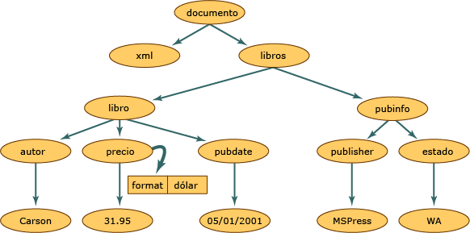

# <a name="xml-document-object-model-dom"></a>Modelo de objetos de documento (DOM) XML
La clase Modelo de objetos de documento XML (DOM) es una representación en la memoria de un documento XML. DOM permite leer, manipular y modificar un documento XML mediante programación. La clase **XmlReader** también lee XML, aunque proporciona acceso de solo avance y de solo lectura sin almacenamiento en memoria caché. Esto significa que no hay funciones para editar los valores de un atributo o contenido de un elemento, ni la posibilidad de agregar y quitar nodos con **XmlReader**. La edición es la función principal de DOM. Es la forma común y estructurada mediante la que se representan datos XML en la memoria, aunque los datos XML reales se almacenan de forma lineal cuando se encuentran en un archivo o proceden de otro objeto. A continuación se muestran datos XML:  
  
## <a name="input"></a>Entrada  
  
```xml  
<?xml version="1.0"?>  
  <books>  
    <book>  
        <author>Carson</author>  
        <price format="dollar">31.95</price>  
        <pubdate>05/01/2001</pubdate>  
    </book>  
    <pubinfo>  
        <publisher>MSPress</publisher>  
        <state>WA</state>  
    </pubinfo>  
  </books>   
```  
  
 En la ilustración siguiente se muestra cómo se estructura la memoria cuando se leen estos datos XML en la estructura DOM.  
  
   
Estructura de documentos XML  
  
 Dentro de la estructura de los documentos XML, cada círculo de esta ilustración representa un nodo, que se denomina objeto **XmlNode**. El objeto **XmlNode** es el objeto básico del árbol de DOM. La clase **XmlDocument**, que extiende la clase **XmlNode**, admite métodos para realizar operaciones en el documento en conjunto (por ejemplo, cargarlo en la memoria o guardar el código XML en un archivo). Además, la clase **XmlDocument** proporciona un medio para ver y manipular los nodos de todo el documento XML. Las clases **XmlNode** y **XmlDocument** han mejorado el rendimiento y la capacidad de uso y disponen de métodos y propiedades para realizar lo siguiente:  
  
-   Obtener acceso y modificar nodos específicos de DOM, como nodos de elemento, de referencia de entidad, etc.  
  
-   Recuperar nodos completos, además de la información que contiene el nodo, como el texto de un nodo de elemento.  
  
    > [!NOTE]
    >  Si una aplicación no requiere la estructura o las funciones de edición proporcionadas por DOM, las clases **XmlReader** y **XmlWriter** proporcionan acceso a secuencias de XML de solo avance sin almacenamiento en caché. Para obtener más información, consulte <xref:System.Xml.XmlReader> y <xref:System.Xml.XmlWriter>.  
  
 Los objetos **Node** tienen un conjunto de métodos y propiedades, así como características básicas y bien definidas. Algunas de estas características son:  
  
-   Un nodo tiene un único nodo primario, que se encuentra directamente encima de él. Los únicos nodos que no tienen un nodo primario son la raíz del documento, puesto que éste es el nodo de nivel superior y contiene el propio documento y fragmentos de documento.  
  
-   La mayor parte de los nodos pueden tener varios nodos secundarios, que son los que están situados inmediatamente debajo de ellos. A continuación se muestra una lista de tipos de nodo que pueden tener nodos secundarios.  
  
    -   **Document**  
  
    -   **DocumentFragment**  
  
    -   **EntityReference**  
  
    -   **Element**  
  
    -   **Attribute**  
  
     Los nodos **XmlDeclaration**, **Notation**, **Entity**, **CDATASection**, **Text**, **Comment**, **ProcessingInstruction** y **DocumentType** no tienen nodos secundarios.  
  
-   Los nodos que se encuentran en el mismo nivel, representados en el diagrama por los nodos **book** y **pubinfo**, son nodos relacionados.  
  
 La forma de controlar los atributos es una característica de DOM. Los atributos no son nodos que forman parte de las relaciones entre los nodos primarios y secundarios y entre nodos relacionados. Los atributos se consideran una propiedad del nodo de elemento y están formados por un par nombre-valor. Por ejemplo, si tiene datos XML formados por `format="dollar`" asociados con el elemento `price`, la palabra `format` es el nombre, y el valor del atributo `format` es `dollar`. Para recuperar el atributo `format="dollar"` del nodo **price**, se llama al método **GetAttribute** cuando el cursor se encuentra en el nodo de elemento `price`. Para obtener más información, vea [Acceso a atributos en DOM](../../../../docs/standard/data/xml/accessing-attributes-in-the-dom.md).  
  
 Los nodos se crean al leer XML en la memoria. Sin embargo, no todos los nodos son del mismo tipo. Un elemento, en XML, tiene reglas y sintaxis diferentes a las de una instrucción de procesamiento. Por tanto, cuando se leen varios datos, se asigna a cada nodo un tipo. Este tipo determina las características y funcionalidad del nodo.  
  
 Para obtener más información acerca de los tipos de nodo generados en la memoria, vea [Tipos de nodos XML](../../../../docs/standard/data/xml/types-of-xml-nodes.md). Para obtener más información acerca de los objetos creados en el árbol de nodos, vea [Asignar la jerarquía de objetos a datos XML](../../../../docs/standard/data/xml/mapping-the-object-hierarchy-to-xml-data.md).  
  
 Microsoft ha extendido las API (Interfaz de programación de aplicaciones) que están disponibles en el nivel 1 y nivel 2 de DOM del W3C (World Wide Web Consortium) para facilitar el trabajo con documentos XML. Aunque son totalmente compatibles con las normas del W3C, las clases, métodos y propiedades adicionales añaden funcionalidades que sobrepasan lo que puede realizarse mediante el XML DOM de W3C. Las nuevas clases permiten tener acceso a datos relacionales, proporcionan métodos para sincronizar con datos de ADO.NET y exponen simultáneamente datos como XML. Para obtener más información, vea [Sincronizar DataSet con XmlDataDocument](../../../../docs/framework/data/adonet/dataset-datatable-dataview/dataset-and-xmldatadocument-synchronization.md).  
  
 DOM resulta más útil para leer datos XML en la memoria y cambiar su estructura, agregar o quitar nodos, o modificar los datos mantenidos en un nodo como en el texto contenido en un elemento. No obstante, hay otras clases disponibles que son más rápidas que DOM en otros escenarios. Para tener un acceso rápido, solo hacia delante y sin almacenamiento en caché a secuencias de XML, utilice **XmlReader** y **XmlWriter**. Si necesita acceso aleatorio con un modelo de cursor y **XPath**, utilice la clase **XPathNavigator**.  
  
## <a name="see-also"></a>Vea también  
 [Tipos de nodos XML](../../../../docs/standard/data/xml/types-of-xml-nodes.md)  
 [Asignación de la jerarquía de objetos a datos XML](../../../../docs/standard/data/xml/mapping-the-object-hierarchy-to-xml-data.md)
