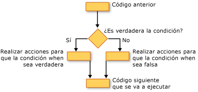

# Estructuras de decisión (Visual Basic)
Visual Basic permite probar condiciones y realizar diferentes operaciones en función de los resultados de esa prueba. Puede probar si una condición es true o false para distintos valores de una expresión o varias excepciones que se genera cuando se ejecuta una serie de instrucciones.  
  
 En la siguiente ilustración muestra una estructura de decisión que comprueba una condición es true y realiza acciones diferentes dependiendo de si es true o false.  
  
   
Emprender acciones diferentes cuando una condición es true y cuando es false  
  
## If... Then... Construcción else  
 `If...Then...Else` construcciones le permiten probar una o más condiciones y ejecutar una o varias instrucciones según cada condición. Puede probar las condiciones y realizar acciones en las siguientes maneras:  
  
-   Ejecutar una o más instrucciones si una condición es `True`  
  
-   Ejecutar una o más instrucciones si una condición es `False`  
  
-   Ejecutar algunas instrucciones si una condición es `True` y otras personas si `False`  
  
-   Probar una condición adicional si es un requisito previo `False`  
  
 La estructura de control que proporciona todas estas posibilidades es la [si... Then... Else (instrucción)](../../../../visual-basic/language-reference/statements/if-then-else-statement.md). Puede usar una versión de línea si tiene simplemente una comprobación y una instrucción que se ejecutará. Si tiene un conjunto más complejo de condiciones y acciones, puede usar la versión de varias líneas.  
  
## Seleccione... Construcción de mayúsculas  
 El `Select...Case` construcción permite evaluar una expresión una vez y ejecutar distintos conjuntos de instrucciones basados en diferentes valores posibles. Para obtener más información, vea [seleccione... Caso instrucción](../../../../visual-basic/language-reference/statements/select-case-statement.md).  
  
## Try... Catch... Por último, construcción  
 `Try...Catch...Finally` construcciones permiten ejecutar un conjunto de instrucciones en un entorno que conserva el control si cualquiera de las instrucciones provoca una excepción. Puede realizar acciones diferentes para diferentes excepciones. También puede especificar un bloque de código que se ejecuta antes de salir de todo el `Try...Catch...Finally` construcción, independientemente de lo que ocurre. Para obtener más información, vea [Try...Catch...Finally Statement](../../../../visual-basic/language-reference/statements/try-catch-finally-statement.md) (Try...Catch...Finally [Instrucción, Visual Basic]).  
  
> [!NOTE]
>  Para muchas de las estructuras de control, al hacer clic en una palabra clave, se resaltan todas las palabras clave en la estructura. Por ejemplo, al hacer clic en `If` en un `If...Then...Else` construcción, todas las instancias de `If`, `Then`, `ElseIf`, `Else`, y `End If` se resaltan en la construcción. Para mover a la palabra clave resaltada siguiente o anterior, presione CTRL + MAYÚS + flecha abajo o CTRL + MAYÚS + flecha arriba.  
  
## Vea también  
 [Flujo de control](../../../../visual-basic/programming-guide/language-features/control-flow/index.md)  
 [Estructuras de bucle](../../../../visual-basic/programming-guide/language-features/control-flow/loop-structures.md)  
 [Estructuras de control adicionales](../../../../visual-basic/programming-guide/language-features/control-flow/other-control-structures.md)  
 [Estructuras de control anidadas](../../../../visual-basic/programming-guide/language-features/control-flow/nested-control-structures.md)  
 [If (operador)](../../../../visual-basic/language-reference/operators/if-operator.md)
