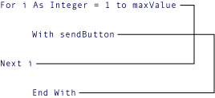

# Estructuras de control anidadas (Visual Basic)
[!INCLUDE[vs2017banner](../../../../csharp/includes/vs2017banner.md)]

Puede colocar instrucciones de control dentro de otras instrucciones de control, por ejemplo un bloque `If...Then...Else` dentro de un bucle `For...Next`.  Cuando una instrucción de control se coloca dentro de otra, se dice que está *anidada*.  
  
## Niveles de anidamiento  
 En [!INCLUDE[vbprvb](../../../../csharp/programming-guide/concepts/linq/includes/vbprvb_md.md)], las estructuras de control pueden anidarse en tantos niveles como se desee.  A fin de que las estructuras anidadas sean más fáciles de leer, es práctica habitual aplicar sangría al cuerpo de cada una.  El editor del entorno de desarrollo integrado \(IDE\) lo hace automáticamente.  
  
 En el siguiente ejemplo, el procedimiento `sumRows` suma los elementos positivos de cada fila de la matriz.  
  
```  
Public Sub sumRows(ByVal a(,) As Double, ByRef r() As Double)  
    Dim i, j As Integer  
    For i = 0 To UBound(a, 1)  
        r(i) = 0  
        For j = 0 To UBound(a, 2)  
            If a(i, j) > 0 Then  
                r(i) = r(i) + a(i, j)  
            End If  
        Next j  
    Next i  
End Sub  
```  
  
 En el ejemplo anterior, la primera instrucción `Next` cierra el bucle `For` interno y la última instrucción `Next` cierra el bucle `For` externo.  
  
 Del mismo modo, en las instrucciones `If` anidadas, las instrucciones `End If` se aplican automáticamente a la instrucción `If` anterior más próxima.  Los bucles `Do` anidados funcionan de forma similar; la instrucción `Loop` más interna está emparejada con la instrucción `Do` más interna.  
  
> [!NOTE]
>  En muchas estructuras de control, al hacer clic en una palabra clave, se resaltan todas las palabras clave en la estructura.  Por ejemplo, al hacer clic en `If` en una construcción `If...Then...Else`, se resaltan todas las instancias de `If`, `Then`, `ElseIf`, `Else` y `End If` de la construcción.  Para desplazarse a la palabra clave resaltada siguiente o anterior, presione CTRL\+MAYÚS\+FLECHA ABAJO o CTRL\+MAYÚS\+FLECHA ARRIBA.  
  
## Anidar diferentes tipos de estructuras de control  
 Puede anidar un tipo de estructura de control dentro de otro tipo.  El ejemplo siguiente utiliza un bloque `With` dentro de un bucle `For Each` y bloques `If` anidados dentro del bloque `With`.  
  
```  
For Each ctl As System.Windows.Forms.Control In Me.Controls  
    With ctl  
        .BackColor = System.Drawing.Color.Yellow  
        .ForeColor = System.Drawing.Color.Black  
        If .CanFocus Then  
            .Text = "Colors changed"  
            If Not .Focus() Then  
                ' Insert code to process failed focus.  
            End If  
        End If  
    End With  
Next ctl  
```  
  
## Superposición de estructuras de control  
 No puede superponer estructuras de control.  Esto significa que cualquier estructura anidada debe estar completamente incluida dentro de la siguiente estructura más profunda.  Por ejemplo, la organización siguiente no es válida porque el bucle `For` finaliza antes de que termine el bloque `With` interno.  
  
   
Anidamiento no válido de estructuras For y With  
  
 El compilador de [!INCLUDE[vbprvb](../../../../csharp/programming-guide/concepts/linq/includes/vbprvb_md.md)] detecta este tipo de estructuras de control superpuestas e indica que se ha producido un error en tiempo de compilación.  
  
## Vea también  
 [Flujo de control](../../../../visual-basic/programming-guide/language-features/control-flow/index.md)   
 [Estructuras de decisión](../../../../visual-basic/programming-guide/language-features/control-flow/decision-structures.md)   
 [Estructuras de bucles](../../../../visual-basic/programming-guide/language-features/control-flow/loop-structures.md)   
 [Estructuras de control adicionales](../../../../visual-basic/programming-guide/language-features/control-flow/other-control-structures.md)