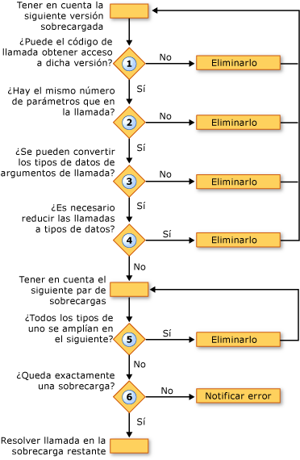

# Resolución de sobrecarga (Visual Basic)
Cuando el compilador de Visual Basic encuentra una llamada a un procedimiento que está definido en varias versiones sobrecargadas, el compilador debe decidir cuál de las sobrecargas para llamar a. Para ello, ejecute los pasos siguientes:  
  
1.  **Accesibilidad.** Elimina cualquier sobrecarga con un nivel de acceso que impide que el código de llamada llamarlo.  
  
2.  **Número de parámetros.** Elimina cualquier sobrecarga que define un número diferente de parámetros que se suministran en la llamada.  
  
3.  **Tipos de datos de parámetro.** El compilador da preferencia de métodos de instancia a través de métodos de extensión. Si se encuentra cualquier método de instancia que requiere solo conversiones de ampliación que coincida con la llamada de procedimiento, se quitan todos los métodos de extensión y el compilador sigue con solo los candidatos de método de instancia. Si no se encuentra ningún método de instancia de este tipo, continúa con la instancia y los métodos de extensión.  
  
     En este paso, elimina cualquier sobrecarga para que los tipos de datos de los argumentos de llamada no se puede convertir a los tipos de parámetro definidos en la sobrecarga.  
  
4.  **Conversiones de restricción.** Elimina cualquier sobrecarga que requiera una conversión de restricción de los tipos de argumento que realiza la llamada a los tipos de parámetro definidos. Esto es cierto si la comprobación de tipo modificador ([Option Strict (instrucción)](../../../../visual-basic/language-reference/statements/option-strict-statement.md)) es `On` o `Off`.  
  
5.  **Ampliación mínima.** El compilador considera que las sobrecargas restantes en parejas. Para cada pareja, compara los tipos de datos de los parámetros definidos. Si los tipos en una de las sobrecargas todos los amplían los tipos correspondientes en la otra, el compilador elimina la última. Es decir, conserva la sobrecarga que requiere la menor cantidad de ampliación.  
  
6.  **Candidata única.** Continúa Considerando las sobrecargas por partes hasta que solo una sobrecarga permanece y resuelve la llamada a esa sobrecarga. Si el compilador no puede reducir las sobrecargas a una sola candidata, genera un error.  
  
 En la siguiente ilustración muestra el proceso que determina qué conjunto de versiones sobrecargadas para llamar a.  
  
   
Resolver entre versiones sobrecargadas  
  
 En el ejemplo siguiente se muestra este proceso de resolución de sobrecarga.  
  
 [!code-vb[VbVbcnProcedures#62](./codesnippet/VisualBasic/overload-resolution_1.vb)]  
  
 [!code-vb[VbVbcnProcedures#63](./codesnippet/VisualBasic/overload-resolution_2.vb)]  
  
 En la primera llamada, el compilador elimina la primera sobrecarga porque el tipo del primer argumento (`Short`) se restringe al tipo del parámetro correspondiente (`Byte`). A continuación, elimina la tercera sobrecarga porque cada argumento de tipo en la segunda sobrecarga (`Short` y `Single`) se amplía al tipo correspondiente en la tercera sobrecarga (`Integer` y `Single`). La segunda sobrecarga requiere una ampliación menor, por lo que el compilador lo utiliza para la llamada.  
  
 En la segunda llamada, el compilador no puede eliminar cualquiera de las sobrecargas sobre la base de restricción. Elimina la tercera sobrecarga por la misma razón que en la primera llamada, porque puede llamar a la segunda sobrecarga con una ampliación menor de los tipos de argumentos. Sin embargo, el compilador no puede resolver entre la primera y la segunda sobrecarga. Cada uno tiene un tipo de parámetro definido que se amplía al tipo correspondiente en el otro (`Byte` a `Short`, pero `Single` a `Double`). Por lo tanto, el compilador genera un error de resolución de sobrecarga.  
  
## Opcionales sobrecargados y ParamArray (argumentos)  
 Si dos sobrecargas de un procedimiento tienen firmas idénticas, salvo que se declara el último parámetro [opcional](../../../../visual-basic/language-reference/modifiers/optional.md) en uno y [ParamArray](../../../../visual-basic/language-reference/modifiers/paramarray.md) en la otra, el compilador resuelve una llamada a ese procedimiento como se indica a continuación:  
  
|Si la llamada suministra el último argumento como|El compilador resuelve la llamada a la sobrecarga declarando el último argumento como|  
|---|---|  
|Ningún valor (argumento omitido)|`Optional`|  
|un valor único|`Optional`|  
|Dos o más valores en una lista separada por comas|`ParamArray`|  
|Una matriz de cualquier longitud (incluida una matriz vacía)|`ParamArray`|  
  
## Vea también  
 [Parámetros opcionales](./optional-parameters.md)  
 [Matrices de parámetros](./parameter-arrays.md)  
 [Sobrecarga de procedimientos](./procedure-overloading.md)  
 [Solución de problemas de procedimientos](./troubleshooting-procedures.md)  
 [Definir varias versiones de un procedimiento](./how-to-define-multiple-versions-of-a-procedure.md)  
 [Llamar a un procedimiento sobrecargado](./how-to-call-an-overloaded-procedure.md)  
 [Sobrecargar un procedimiento que toma parámetros opcionales](./how-to-overload-a-procedure-that-takes-optional-parameters.md)  
 [Sobrecargar un procedimiento que toma un número indefinido de parámetros](./how-to-overload-a-procedure-that-takes-an-indefinite-number-of-parameters.md)  
 [Consideraciones sobre la sobrecarga de procedimientos](./considerations-in-overloading-procedures.md)  
 [Sobrecargas](../../../../visual-basic/language-reference/modifiers/overloads.md)  
 [Métodos de extensión](./extension-methods.md)
