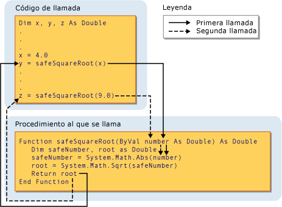

# Argumentos y par&#225;metros de procedimiento (Visual Basic)
[!INCLUDE[vs2017banner](../../../../visual-basic/developing-apps/includes/vs2017banner.md)]

En la mayoría de los casos, un procedimiento necesita cierta información sobre las circunstancias en las que se le ha llamado.  Un procedimiento que ejecuta tareas repetidas o compartidas utiliza datos distintos en cada llamada.  Estos datos se componen de variables, constantes y expresiones que se transfieren al procedimiento cada vez que se le llama.  
  
 Un *parámetro* representa un valor que el procedimiento espera que se proporcione cuando es llamado.  La declaración del procedimiento define sus parámetros.  
  
 Puede definir un procedimiento sin parámetros, con un parámetro o con varios.  La parte de la definición del procedimiento que especifica los parámetros se denomina *lista de parámetros*.  
  
 Un *argumento* representa el valor que se proporciona a un parámetro del procedimiento cuando se llama al procedimiento.  El código de llamada proporciona los argumentos cuando llama al procedimiento.  La parte de la llamada del procedimiento que especifica los argumentos se denomina *lista de argumentos*.  
  
 En la siguiente ilustración se muestra un código que llama al procedimiento `safeSquareRoot` desde dos lugares diferentes.  La primera llamada transfiere el valor de la variable `x` \(4.0\) al parámetro `number` y el valor devuelto en `root` \(2.0\) se asigna a la variable `y`.  La segunda llamada transfiere el valor literal 9.0 a `number` y asigna el valor devuelto \(3.0\) a la variable `z`.  
  
   
Pasar un argumento a un parámetro  
  
 Para obtener más información, vea [Diferencias entre parámetros y argumentos](../../../../visual-basic/programming-guide/language-features/procedures/differences-between-parameters-and-arguments.md).  
  
## Tipo de datos de parámetro  
 El tipo de datos de un parámetro se define utilizando la cláusula `As` en su declaración.  Por ejemplo, la siguiente función acepta una cadena y un entero.  
  
 [!code-vb[VbVbcnProcedures#32](../../../../visual-basic/programming-guide/language-features/procedures/codesnippet/visualbasic/procedure-parameters-and_1.vb)]  
  
 Si el modificador de comprobación de tipos \([Option Strict \(Instrucción\)](../../../../visual-basic/language-reference/statements/option-strict-statement.md)\) es `Off,` la cláusula `As` es opcional, pero si la utiliza un parámetro, deben utilizarla todos.  Si la comprobación de tipos es `On`, la cláusula `As` será obligatoria para todos los parámetros del procedimiento.  
  
 Si el código de llamada espera que se proporcione un argumento con un tipo de datos diferente al del parámetro correspondiente, por ejemplo `Byte` a un parámetro `String`, debe llevar a cabo una de las operaciones siguientes:  
  
-   Proporcionar sólo argumentos con tipos de datos que se amplíen al tipo de datos del parámetro;  
  
-   Establecer `Option Strict Off` para que permita conversiones de restricción implícitas; o  
  
-   Utilizar una palabra clave de conversión para convertir explícitamente el tipo de datos.  
  
### Parámetros de tipo  
 Un *procedimiento genérico* también define uno o más *parámetros de tipo*, además de sus parámetros normales.  Un procedimiento genérico permite que el código que llama pase tipos de datos distintos cada vez que llame al procedimiento; por tanto, puede personalizar los tipos de datos para los requisitos de cada llamada individual.  Vea [Procedimientos genéricos en Visual Basic](../../../../visual-basic/programming-guide/language-features/data-types/generic-procedures.md).  
  
## Vea también  
 [Procedimientos](../../../../visual-basic/programming-guide/language-features/procedures/index.md)   
 [Procedimientos Sub](../../../../visual-basic/programming-guide/language-features/procedures/sub-procedures.md)   
 [Procedimientos Function](../../../../visual-basic/programming-guide/language-features/procedures/function-procedures.md)   
 [Procedimientos de propiedad](../../../../visual-basic/programming-guide/language-features/procedures/property-procedures.md)   
 [Procedimientos de operador](../../../../visual-basic/programming-guide/language-features/procedures/operator-procedures.md)   
 [Cómo: Definir un parámetro para un procedimiento](../../../../visual-basic/programming-guide/language-features/procedures/how-to-define-a-parameter-for-a-procedure.md)   
 [Cómo: Pasar argumentos a un procedimiento](../../../../visual-basic/programming-guide/language-features/procedures/how-to-pass-arguments-to-a-procedure.md)   
 [Pasar argumentos por valor y por referencia](../../../../visual-basic/programming-guide/language-features/procedures/passing-arguments-by-value-and-by-reference.md)   
 [Sobrecarga de procedimientos](../../../../visual-basic/programming-guide/language-features/procedures/procedure-overloading.md)   
 [Conversiones de tipos en Visual Basic](../../../../visual-basic/programming-guide/language-features/data-types/type-conversions.md)